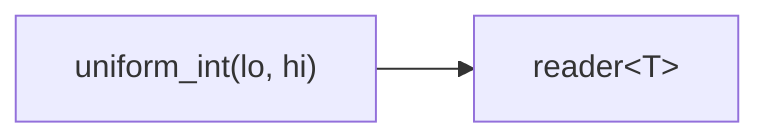
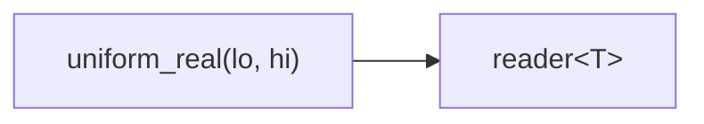
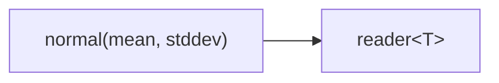
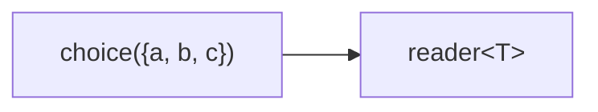
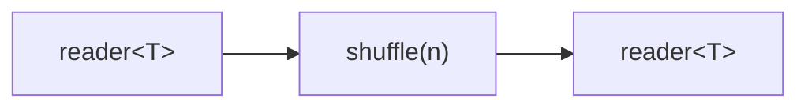

# random

Random number generators and a shuffle filter. All functions live in
`namespace csp::part::rand`.

**Header:** `#include "csp.h"`

Every function takes an optional trailing `Engine` parameter (defaulting to
`std::mt19937_64` seeded from `std::random_device`). Pass a seeded engine for
reproducibility:

```cpp
rand::uniform_int(1, 6, std::mt19937_64{42})  // deterministic
```

---

## uniform_int

Infinite stream of uniform random integers in \[lo, hi\].

### Signature

```cpp
template <typename T, typename Engine = std::mt19937_64>
auto uniform_int(T lo, T hi,
                 Engine eng = Engine{std::random_device{}()});
// Returns: producer<T>
```

### Topology



### Semantics

- Emits values from `std::uniform_int_distribution<T>(lo, hi)` indefinitely.
- Exits when the downstream reader is destroyed.
- `T` must be an integer type accepted by `std::uniform_int_distribution`.

### Example

```cpp
using namespace csp::part;

auto r = rand::uniform_int(1, 6).spawn();  // simulated die rolls
for (int i = 0; i < 100; ++i) {
    int roll = r.read();  // 1..6 inclusive
}
```

---

## uniform_real

Infinite stream of uniform random reals in \[lo, hi).

### Signature

```cpp
template <typename T, typename Engine = std::mt19937_64>
auto uniform_real(T lo, T hi,
                  Engine eng = Engine{std::random_device{}()});
// Returns: producer<T>
```

### Topology



### Semantics

- Emits values from `std::uniform_real_distribution<T>(lo, hi)` indefinitely.
- Exits when the downstream reader is destroyed.
- `T` must be a floating-point type (`float`, `double`, `long double`).

### Example

```cpp
using namespace csp::part;

auto r = rand::uniform_real(0.0, 1.0).spawn();
double x = r.read();  // [0.0, 1.0)
```

---

## bernoulli

Infinite stream of random bools with P(true) = p.

### Signature

```cpp
template <typename Engine = std::mt19937_64>
auto bernoulli(double p = 0.5,
               Engine eng = Engine{std::random_device{}()});
// Returns: producer<bool>
```

### Topology


### Semantics

- Emits values from `std::bernoulli_distribution(p)` indefinitely.
- `p = 0.0` always emits `false`; `p = 1.0` always emits `true`.
- Exits when the downstream reader is destroyed.

### Example

```cpp
using namespace csp::part;

// Coin flip stream
auto r = rand::bernoulli(0.5).spawn();
bool heads = r.read();
```

---

## normal

Infinite stream of normally distributed values.

### Signature

```cpp
template <typename T = double, typename Engine = std::mt19937_64>
auto normal(T mean = 0, T stddev = 1,
            Engine eng = Engine{std::random_device{}()});
// Returns: producer<T>
```

### Topology



### Semantics

- Emits values from `std::normal_distribution<T>(mean, stddev)` indefinitely.
- Exits when the downstream reader is destroyed.
- `T` must be a floating-point type.

### Example

```cpp
using namespace csp::part;

// Standard normal: mean=0, stddev=1
auto r = rand::normal().spawn();
double z = r.read();

// Custom parameters
auto r2 = rand::normal(100.0, 15.0).spawn();
double iq = r2.read();
```

---

## choice

Infinite stream of random picks from a container.

### Signature

```cpp
template <typename T, typename C, typename Engine = std::mt19937_64>
auto choice(C&& c, Engine eng = Engine{std::random_device{}()});

template <typename T, typename Engine = std::mt19937_64>
auto choice(std::initializer_list<T> c,
            Engine eng = Engine{std::random_device{}()});
// Returns: producer<T>
```

### Topology



### Semantics

- Picks uniformly at random from the container (by index) on each emission.
- The container is captured by value. The `initializer_list` overload copies
  into a `std::vector<T>`.
- The container must support `operator[]` and `size()`.
- Exits when the downstream reader is destroyed.

### Example

```cpp
using namespace csp::part;

auto r = rand::choice<int>({10, 20, 30}).spawn();
int v = r.read();  // 10, 20, or 30 with equal probability

std::vector<std::string> words = {"alpha", "beta", "gamma"};
auto r2 = rand::choice<std::string>(words).spawn();
```

---

## shuffle

Reservoir shuffle filter. Buffers up to n elements, then for each new input
picks a random slot, emits the displaced element, and stores the new one.
On input exhaustion, Fisher-Yates shuffles the remaining buffer and emits all.

### Signature

```cpp
template <typename T, typename Engine = std::mt19937_64>
auto shuffle(size_t n,
             Engine eng = Engine{std::random_device{}()});
// Returns: filter<T, T, ...>
```

### Topology



### Semantics

- **Fill phase**: reads up to n elements into an internal buffer.
- **Steady state**: for each subsequent input element, picks a random index
  in \[0, buffer size), emits the element at that index, and replaces it with
  the new input.
- **Drain phase**: when the input is exhausted, Fisher-Yates shuffles the
  buffer and emits all remaining elements.
- The output is always a permutation of the input.
- If the input has fewer than n elements, all elements are buffered and
  emitted in random order during the drain phase.
- Exits when the downstream reader is destroyed or after the drain phase.
- Backpressure: blocks on each output write during steady state and drain.

### Example

```cpp
using namespace csp::part;

// Shuffle a sequence of 20 integers through a 5-element buffer.
auto r = (count(1, 21) | rand::shuffle<int>(5)).spawn();
for (int v : r) {
    // All 20 values, in shuffled order
}

// Reproducible shuffle
auto r2 = (count(1, 11)
    | rand::shuffle<int>(3, std::mt19937_64{42})).spawn();
```

## See Also

- [count](count.md) -- arithmetic sequence source
- [enumerate](enumerate.md) -- stream container elements
- [stride](stride.md) -- take every Nth element
