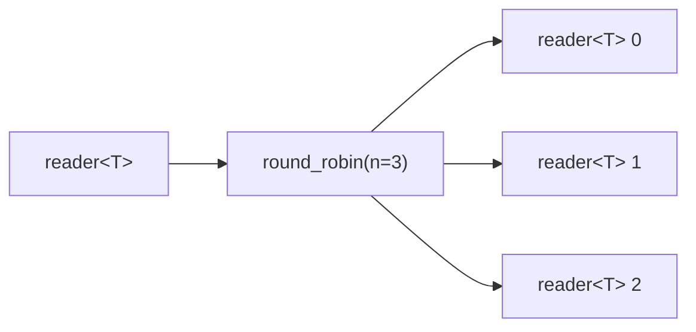

# round_robin

Distributes input elements across N outputs in round-robin fashion. Each value
goes to exactly one output. This is the deterministic dual of
[interleave](interleave.md).

## Signature

```cpp
template <typename T>
auto round_robin(reader<T> in, size_t n);
// Returns: std::vector<reader<T>>
```

## Topology



One internal microthread reads from the input and writes to output channels in
strict cyclic order: element 0 goes to output 0, element 1 to output 1, and so
on, wrapping at `n`.

## Semantics

- Returns a vector of `n` readers, one per output leg.
- Exits when the input is exhausted or all outputs have died.
- **Dead output handling**: when an output reader is dropped, that leg is
  removed from the rotation and the current value is retried on the next live
  output. The remaining legs continue in order.
- Backpressure: each write blocks until the corresponding output reader
  consumes the value, so slow consumers throttle the entire fan-out. All output
  legs must be drained concurrently since channels are synchronous.
- Elements are moved into the output channel.

## Example

```cpp
#include <csp/csp.h>
#include <csp/part/round_robin.h>
#include <csp/part/count.h>

using namespace csp;
using namespace csp::part;

// Distribute 1..9 across 3 outputs.
auto outs = round_robin(count(1, 10).spawn(), 3);
// outs[0] reads: 1, 4, 7
// outs[1] reads: 2, 5, 8
// outs[2] reads: 3, 6, 9
```

## See Also

- [interleave](interleave.md) -- deterministic dual: merge N inputs into one output
- [partition](partition.md) -- route by classifier function instead of position
- [tee](tee.md) -- duplicate every element to all outputs (broadcast, not distribute)
