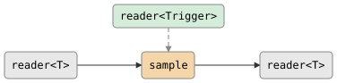

# csp::part::sample

On each trigger, emit the most recent value from a source stream. The source
is latched (not consumed on each trigger), so the same value can be emitted
multiple times if no new source value arrives between triggers.

**Header:** `<csp/part/sample.h>`

## Synopsis

```cpp
template <typename T>
struct sample_config {
    writer<T> dead_letter = {};
};

template <typename T, typename Trigger = poke_t>
auto sample(reader<T> source, reader<Trigger> trigger, sample_config<T> cfg = {});
```

Returns a `producer<T>`.

## Parameters

| Parameter | Type | Default | Description |
|-----------|------|---------|-------------|
| `source` | `reader<T>` | | Stream whose latest value is sampled |
| `trigger` | `reader<Trigger>` | | Stream that triggers emission (default `poke_t`) |
| `cfg.dead_letter` | `writer<T>` | `{}` | Optional: overwritten latched values are written here instead of discarded |

## Diagram

<!-- csp-flow
       reader<Trigger>
             |
reader<T> -> {sample} -> reader<T>
-->


### Timing

```
source:  ──A──B──C──────────D──────
trigger: ────────────t────t────t───
output:  ────────────C────C────D───
```

The trigger samples whatever the source most recently produced.

## Semantics

- Source values are latched (stored) as they arrive. Only the latest value is
  retained.
- When a trigger arrives and a source value has been latched, the latest value
  is emitted.
- When a trigger arrives before any source value, nothing is emitted (the
  trigger is consumed but no output is produced).
- **Source faster than trigger:** intermediate source values are silently
  replaced (or sent to `dead_letter` if provided). Only the value current at
  trigger time is emitted.
- **Trigger faster than source:** the same latched value is emitted on each
  trigger.
- After the source dies, the last latched value continues to be emitted on
  each subsequent trigger until the trigger stream or output dies.
- On output close, the part returns immediately.

## Usage

### With a timer trigger

```cpp
using namespace std::chrono_literals;

// Sample a fast-updating sensor every 100ms.
auto r = sample(sensor_reader, csp::tick(100ms)).spawn();
```

### With a manual trigger

```cpp
auto [trig_w, trig_r] = csp::chan<>{};
auto r = sample(source, std::move(trig_r)).spawn();

// Trigger sampling on demand.
trig_w << csp::poke;
```

### With a typed trigger

```cpp
// Trigger carries metadata (ignored for sampling, but available to caller).
auto r = sample<int, std::string>(source, request_reader).spawn();
```

## Example

```cpp
#include "csp.h"

using namespace csp::part;

auto [trig_w, trig_r] = csp::chan<>{};
auto r = sample(count(1, 4).spawn(), std::move(trig_r)).spawn();

csp::spawn([trig_w = std::move(trig_w)] {
    // Let source values (1, 2, 3) latch first.
    csp::yield();
    trig_w << csp::poke;
    trig_w << csp::poke;
});

// Source 1,2,3 all latched; triggers emit latest (3) twice.
// Output: 3, 3
for (int v; r >> v;) { /* ... */ }
```

## Note

Unlike `delay`, `debounce`, and `throttle`, `sample` is a **producer** (not a
filter) because it takes two input readers rather than transforming a single
stream. It cannot be composed with `|` as a filter stage. To integrate it into
a pipeline, spawn it and pipe the resulting reader.

## See also

- [gate](gate.md) -- pause/resume forwarding via a control channel
- [throttle](throttle.md) -- rate-limit by dropping excess values
