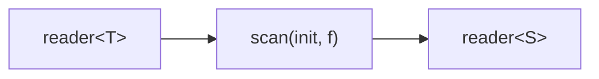

# scan

Running fold (accumulator). Starts with an initial value, applies
`acc = f(acc, value)` for each input element, and emits the new accumulator
after every step.

## Signature

```cpp
template <typename T, typename S, typename F>
auto scan(S init, F&& f);
// Returns: filter<T, S, ...>
```

## Topology



One internal microthread maintains the accumulator, reads each input, applies
`f`, and writes the updated accumulator to the output.

## Semantics

- Exits when the input is exhausted or the output reader is dropped.
- Emits one output for every input element. The first output is
  `f(init, first_input)`.
- The accumulator and the input value are both moved into `f`.
- `T` and `S` can be different types, allowing type-changing accumulation
  (e.g. accumulating string lengths into an `int`).
- Backpressure: blocks on each output write before consuming the next input.

## Example

```cpp
#include <csp/csp.h>
#include <csp/part/scan.h>
#include <csp/part/count.h>

using namespace csp;
using namespace csp::part;

// Running sum: 1, 3, 6, 10, 15
auto r = scan<int, int>(0, [](int acc, int v) { return acc + v; })
             .spawn(count(1, 6).spawn());

// Type-changing: accumulate string lengths into an int.
auto r2 = scan<std::string, int>(0,
              [](int acc, std::string s) { return acc + (int)s.size(); })
              .spawn(enumerate<std::string>({"ab", "cde", "f"}).spawn());
// Reads: 2, 5, 6
```

## See Also

- [reduce](reduce.md) -- fold to a single final value (blocks until input exhausted)
- [map](map.md) -- stateless element-wise transform
