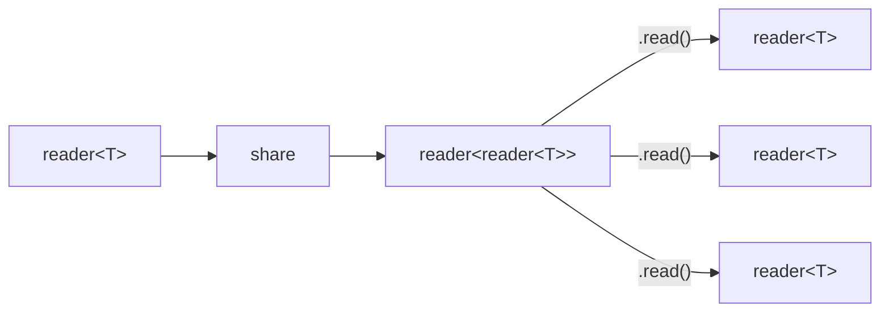
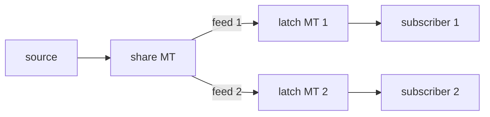

# share

Broadcasts a single source stream to multiple independent subscribers. Each
subscriber gets a dedicated latch microthread with independent backpressure: a
slow subscriber sees latest-value semantics (intermediate values are
overwritten), while fast subscribers see every value.

## Signature

```cpp
template <typename T>
reader<reader<T>> share(reader<T> source);
```

## Topology



Each call to `.read()` on the returned meta-reader creates a new subscription.
Internally, each subscription spawns a per-subscriber latch microthread that
mediates delivery.



## Semantics

- **Subscription**: Reading from the returned `reader<reader<T>>` creates a new
  subscriber. Each subscriber immediately receives the most recent value (if one
  has been published) followed by subsequent updates.
- **Independent backpressure**: Each subscriber has its own latch microthread. A
  slow subscriber does not block the source or other subscribers. Instead,
  intermediate values are overwritten and the subscriber sees only the latest
  value when it next reads.
- **Late subscribers**: A subscriber that joins after values have been published
  receives the current (most recent) value as its first read, then subsequent
  updates.
- **Subscriber death**: When a subscriber drops its reader, the corresponding
  latch microthread terminates and the feed writer is removed. Other subscribers
  are unaffected.
- **Source death**: When the source closes, each latch delivers its last value
  and then closes.
- **Subscription channel closure**: Once the meta-reader is dropped (no more
  subscribers can join), `share` continues serving existing subscribers. When all
  subscribers are gone, the share microthread terminates.

## Example

```cpp
#include <csp/csp.h>
#include <csp/part/share.h>
#include <csp/part/count.h>

using namespace csp;
using namespace csp::part;

csp::spawn([]{
    auto subs = share(count(1, 4).spawn());

    auto a = subs.read();  // Subscriber A
    auto b = subs.read();  // Subscriber B
    subs = {};             // Done subscribing.

    // Both subscribers receive each value independently.
    // a.read() -> 1, b.read() -> 1
    // a.read() -> 2, b.read() -> 2
    // a.read() -> 3, b.read() -> 3
});
csp::schedule();
```

## See Also

- [tee](tee.md) -- duplicate a stream to a side channel (1:2 fan-out)
- [fanout](fanout.md) -- broadcast to multiple writers
- [latch](latch.md) -- hold and serve the most recent value
