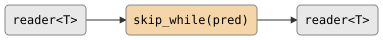

# csp::part::skip_while

Drops elements from the input while a predicate returns true. Once an element
fails the predicate, that element and all subsequent elements are forwarded.

## Signature

```cpp
template <typename T, typename Pred>
auto skip_while(Pred&& pred);
// Returns: filter<T, T, ...>
```

## Topology

<!-- csp-flow
reader<T> -> {skip_while(pred)} -> reader<T>
-->


One internal imp reads from the input. While the predicate returns
true, elements are discarded. Once the predicate fails, the failing element
and all remaining elements are forwarded to the output.

## Semantics

- Exits when the input is exhausted or the output reader is dropped.
- The transition from skipping to forwarding happens exactly once. After the
  first element fails the predicate, the predicate is never called again.
- If the predicate returns true for every element, the output closes with no
  values emitted.
- If the predicate returns false for the first element, all elements pass
  through (identity behavior).
- Values are moved into the output channel.

## Example

```cpp
#include "csp.h"

using namespace csp;
using namespace csp::part;

auto r = skip_while<int>([](int n) { return n < 4; })
             .spawn(count(1, 8).spawn());
// Reads: 4, 5, 6, 7
// (1, 2, 3 are dropped; 4 fails the predicate and is forwarded)
```

## See Also

- [take_while](take_while.md) -- forward while predicate holds, then stop
- [skip_first](first_last.md) -- drop a fixed number of elements
- [where](where.md) -- filter by predicate without stopping
