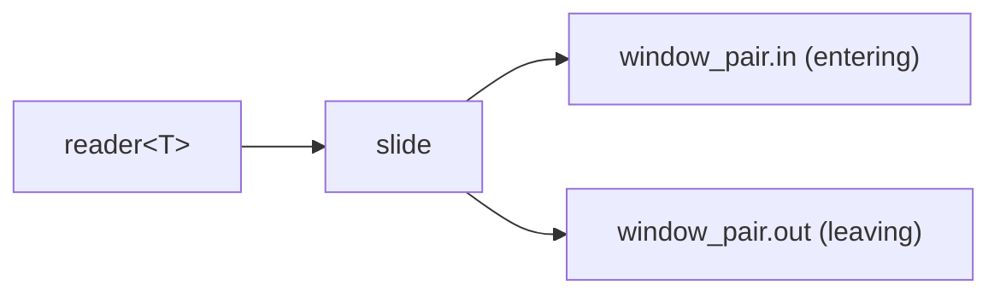

# slide

Two-channel sliding window. Instead of emitting the full window contents,
`slide` provides two separate readers: one for elements entering the window
and one for elements leaving it. This is useful when downstream logic needs
to react to individual enter/leave events rather than snapshot the whole
window.

Two overloads are provided: a fixed-size window (`size_t n`) and a
predicate-based window where a callback decides when older elements expire.

## Signature

```cpp
template <typename T>
struct window_pair {
    reader<T> in;   // elements entering the window
    reader<T> out;  // elements leaving the window
};

struct slide_config {
    bool slide_in = true;
};

// Fixed-size window: expires oldest when window exceeds n elements.
template <typename T>
window_pair<T> slide(reader<T> src, size_t n, slide_config cfg = {});

// Predicate window: expired(older, current) returns true when older
// should leave the window.
template <typename T, typename Pred>
window_pair<T> slide(reader<T> src, Pred expired, slide_config cfg = {});
```

## Topology



One internal imp reads from the source, manages the deque, and
writes to both output channels.

## Semantics

- **Fixed-size**: when a new element arrives and the window already holds
  `n` elements, the oldest is sent on the `out` channel before the new
  element is sent on `in`.
- **Predicate**: for each new element, all front elements where
  `expired(front, current)` is true are sent on `out` before the new
  element is sent on `in`.
- **`slide_in` parameter**: when `true` (default), elements are emitted on
  the `in` channel during the initial growth phase (before any expiry
  occurs). When `false`, both channels are silent until the first expiry
  event.
- Both output channels must be drained concurrently; if only one is read
  the imp will block.
- Exits when the source is exhausted or either output reader is dropped.

## Example

```cpp
#include "csp.h"

using namespace csp;
using namespace csp::part;

// Fixed-size window of 3 over 1..6.
auto [in, out] = slide<int>(count(1, 7).spawn(), size_t(3));

// Must drain both concurrently (e.g. in separate imps).
// in reads:  1, 2, 3, 4, 5, 6
// out reads: 1, 2, 3

// Predicate: expire when older <= current - 3.
auto [in2, out2] = slide<int>(count(1, 9).spawn(),
    [](const int& older, const int& current) {
        return older <= current - 3;
    });
// in2 reads:  1, 2, 3, 4, 5, 6, 7, 8
// out2 reads: 1, 2, 3, 4, 5
```

## See Also

- [window](window.md) -- snapshot-based sliding window (single output)
- [batch](batch.md) -- non-overlapping fixed-size grouping
- [nwise](nwise.md) -- sliding window emitting fixed-size tuples
