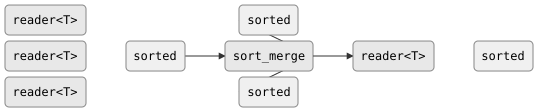

# csp::part::sort_merge

Merges N pre-sorted input streams into a single sorted output stream using a
min-heap. Each input must already be sorted according to the comparator.
The output is a single sorted stream containing all elements from all inputs.

## Signature

```cpp
template <typename T, typename Cmp = std::less<T>>
auto sort_merge(std::vector<reader<T>> inputs, Cmp cmp = {});
// Returns: producer<T, ...>
```

## Topology

<!-- csp-flow
reader<T> (sorted) ->
reader<T> (sorted) -> sort_merge -> reader<T> (sorted)
reader<T> (sorted) ->
-->


One internal imp maintains a min-heap over the head elements of all live
inputs. Each step pops the minimum, emits it, and refills from the
corresponding input.

## Semantics

- Primes the heap by reading one element from each input. Inputs that are
  immediately exhausted are excluded.
- Each step pops the minimum element (according to `cmp`), writes it to the
  output, and reads the next element from the same input. If that input is
  exhausted, it is removed from the heap.
- Finishes when the heap is empty (all inputs exhausted).
- Exits early if the output reader is dropped (output death stops processing).
- **Precondition**: each input stream must be sorted according to `cmp`.
  Behaviour is undefined if an input is not sorted.
- Backpressure: the imp blocks on each output write, so a slow consumer
  throttles reading from all inputs.
- An empty input vector produces an immediately-closed output.
- A single input is forwarded directly (degenerate case).

## Example

```cpp
#include "csp.h"

using namespace csp;
using namespace csp::part;

// Merge three sorted streams.
std::vector<reader<int>> rs;
rs.push_back(enumerate<int>({1, 4, 7}).spawn());
rs.push_back(enumerate<int>({2, 5, 8}).spawn());
rs.push_back(enumerate<int>({3, 6, 9}).spawn());
auto r = sort_merge(std::move(rs)).spawn();
// Reads: 1, 2, 3, 4, 5, 6, 7, 8, 9
```

## See Also

- [merge](merge.md) -- non-deterministic merge (does not preserve sort order)
- [interleave](interleave.md) -- deterministic round-robin merge (no sort awareness)
