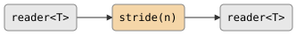

# stride

Takes every Nth element from a stream (0-indexed: emits elements at indices
0, N, 2N, ...). `stride(1)` is the identity; `stride(2)` emits every other
element starting with the first.

## Signature

```cpp
template <typename T>
auto stride(size_t n);
// Returns: filter<T, T, ...>
```

## Topology

<!-- csp-flow
reader<T> -> {stride(n)} -> reader<T>
-->


One internal imp reads from the input, emits every Nth value, and
discards the rest.

## Semantics

- Exits when the input is exhausted or the output reader is dropped.
- The first element (index 0) is always emitted, then every Nth element
  thereafter.
- Elements at non-stride positions are consumed and discarded.
- `stride(1)` passes all elements through unchanged.
- Values are moved into the output channel.

## Example

```cpp
#include "csp.h"

using namespace csp;
using namespace csp::part;

auto r = stride<int>(3).spawn(count(1, 11).spawn());
// Reads: 1, 4, 7, 10
// (indices 0, 3, 6, 9 of the input stream)

auto r2 = stride<int>(2).spawn(count(1, 8).spawn());
// Reads: 1, 3, 5, 7
```

## See Also

- [first](first_last.md) -- take the first N elements
- [where](where.md) -- filter by arbitrary predicate
- [take_while](take_while.md) -- take elements while predicate holds
