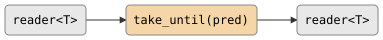

# take_until

Forwards elements from the input until a predicate returns true, inclusive of
the terminating element. Unlike `take_while`, which excludes the element that
fails the predicate, `take_until` emits the element that triggers termination
before closing the output.

## Signature

```cpp
template <typename T, typename Pred>
auto take_until(Pred&& pred);
// Returns: filter<T, T, ...>
```

## Topology

<!-- csp-flow
reader<T> -> {take_until(pred)} -> reader<T>
-->


One internal imp reads from the input, writes each value to the output,
and tests it with `pred`. When `pred` returns true, the value is emitted
and then the output is closed.

## Semantics

- Exits when the predicate returns true (after emitting the matching element),
  the input is exhausted, or the output reader is dropped.
- The element that satisfies the predicate *is* written to the output before
  closing. This is the key distinction from `take_while`.
- If no element ever satisfies the predicate, all input elements are forwarded
  and the output closes when the input is exhausted.
- If the predicate returns true for the first element, exactly one value is
  emitted.
- Values are moved into the output channel.

## Example

```cpp
#include "csp.h"

using namespace csp;
using namespace csp::part;

auto r = take_until<int>([](int n) { return n == 4; })
             .spawn(count(1, 8).spawn());
// Reads: 1, 2, 3, 4
// (4 satisfies the predicate; it is emitted, then the output closes)
```

## See Also

- [take_while](take_while.md) -- forward while predicate holds, excluding the failing element
- [skip_while](skip_while.md) -- drop elements while predicate holds, then forward the rest
