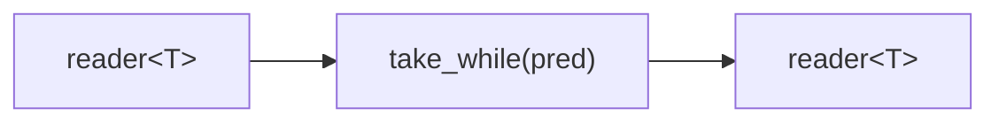

# take_while

Forwards elements from the input while a predicate returns true. As soon as an
element fails the predicate, the output is closed and the microthread exits.
The failing element is not forwarded.

## Signature

```cpp
template <typename T, typename Pred>
auto take_while(Pred&& pred);
// Returns: filter<T, T, ...>
```

## Topology



One internal microthread reads from the input, tests each value with `pred`,
and writes it to the output. On the first failure, the output is closed.

## Semantics

- Exits when the predicate returns false, the input is exhausted, or the
  output reader is dropped.
- The element that fails the predicate is consumed from the input but is
  *not* written to the output.
- If all elements pass the predicate, the output closes when the input is
  exhausted.
- If the predicate never passes (returns false for the first element), the
  output closes immediately with no values emitted.
- Values are moved into the output channel.

## Example

```cpp
#include <csp/csp.h>
#include <csp/part/take_while.h>
#include <csp/part/count.h>

using namespace csp;
using namespace csp::part;

auto r = take_while<int>([](int n) { return n < 4; })
             .spawn(count(1, 8).spawn());
// Reads: 1, 2, 3
// (4 fails the predicate; output closes)
```

## See Also

- [skip_while](skip_while.md) -- drop elements while predicate holds, then forward the rest
- [first](first_last.md) -- take a fixed number of elements
- [where](where.md) -- filter by predicate without stopping
