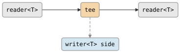

# csp::part::tee

Duplicates a stream to a side channel. Each value read from the input is
written to both the main output and a side `writer<T>`. If the side channel
dies, values continue flowing to the main output uninterrupted.

## Signature

```cpp
template <typename T>
auto tee(writer<T> side);
// Returns: filter<T, T, ...>
```

## Topology

<!-- csp-flow
reader<T> -> {tee} -> reader<T>
               |
         writer<T> side
-->


One internal imp reads from the input and writes each value to both
the main output and the side channel.

## Semantics

- Exits when the input is exhausted or the main output reader is dropped.
- Each value is written to the main output first, then moved to the side
  channel.
- If the side channel's reader is dropped (side channel dies), the tee
  enters a fallback loop that forwards remaining values only to the main
  output. No values are lost.
- Backpressure: the imp blocks on each write, so a slow side
  consumer can throttle the entire pipeline until the side channel dies.

## Example

```cpp
#include "csp.h"

using namespace csp;
using namespace csp::part;

chan<int> src, dst, side;

// Wire: src.r -> tee -> dst.w, with a copy to side.w
spawn(tee<int>(std::move(side.w))
    .bind(std::move(src.r), std::move(dst.w)));

// Producer writes 1..5
spawn([w = std::move(src.w)]{
    for (int i = 1; i <= 5; ++i) w << i;
});

// Both dst.r and side.r receive 1, 2, 3, 4, 5
```

## See Also

- [fanout](fanout.md) -- broadcast to a dynamic set of subscribers
- [share](share.md) -- broadcast via latched subscription model
