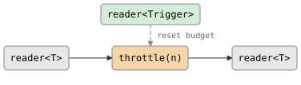

# throttle

Rate-limit a stream: forward up to `n` values per trigger, dropping excess.
The budget starts at `n`, so the first `n` values pass immediately. Each
trigger resets the budget. Use with `tick(d)` for periodic resets.

**Header:** `<csp/part/throttle.h>`

## Synopsis

```cpp
template <typename T, typename Trigger = poke_t>
auto throttle(reader<Trigger> trigger, size_t n = 1, writer<T> dead_letter = {});
```

Returns a `filter<T, T>`.

## Parameters

| Parameter | Type | Default | Description |
|-----------|------|---------|-------------|
| `trigger` | `reader<Trigger>` | | Channel whose values reset the budget to `n` |
| `n` | `size_t` | `1` | Number of values allowed per trigger |
| `dead_letter` | `writer<T>` | `{}` | Optional: excess values are written here instead of discarded |

## Diagram



### Timing (n=2)

```
in:  ──1──2──3──4──────────5──6──7──
     │←── interval ──→│
out: ──1──2────────────5──6─────────
              3,4 dropped     7 dropped
```

## Semantics

- Each value received on the `trigger` channel resets the remaining budget
  to `n`. The trigger value itself is discarded — only the signal matters.
- Budget starts at `n` (first `n` values pass immediately before any trigger).
- When a value arrives and `remaining > 0`, the value is forwarded and the
  budget is decremented.
- When a value arrives and `remaining == 0`, the value is silently dropped
  (or written to `dead_letter` if provided).
- **Values arrive faster than the budget allows:** excess values within each
  interval are dropped. The first `n` values per trigger always pass.
- **Values arrive slower than one per interval:** every value passes
  (budget is always available).
- On input close, the filter returns (no drain phase).
- On output or trigger death, the filter returns.

## Usage

### As a pipeline filter

```cpp
using namespace std::chrono_literals;

// At most 1 value per second.
auto r = throttle<int>(tick(1s)).spawn(source.spawn());
```

### With higher budget

```cpp
// At most 5 values per 100ms.
auto r = throttle<int>(tick(100ms), 5).spawn(source.spawn());
```

### Composed with `|`

```cpp
auto pipeline = count(1, 6) | throttle<int>(tick(1s), 2);
auto r = pipeline.spawn();
// Only 1 and 2 pass (budget=2, all values arrive in first interval).
```

### Standalone spawn

```cpp
auto ch = throttle<int>(tick(100ms), 2).spawn();
csp::spawn([w = std::move(ch.w)] {
    // First burst: 1,2,3
    w << 1; w << 2; w << 3;
    // Wait for tick to reset budget.
    csp::sleep(150ms);
    // Second burst: 4,5,6
    w << 4; w << 5; w << 6;
});
// Output: 1, 2, 4, 5  (3 and 6 dropped)
```

### Custom trigger source

```cpp
// Manual trigger — budget resets when you say so.
auto [trig_w, trig_r] = chan<>{};
auto ch = throttle<int>(std::move(trig_r), 3).spawn();
// ... write values to ch.w ...
trig_w << poke;  // reset budget to 3
```

## Example

```cpp
#include "csp.h"

using namespace csp::part;
using namespace std::chrono_literals;

// Budget=2, interval=100ms. First two pass, rest dropped within interval.
auto th = throttle<int>(tick(100ms), 2).spawn();

csp::spawn([w = std::move(th.w)] {
    w << 1; w << 2; w << 3;       // 1,2 pass; 3 dropped
    csp::sleep(150ms);
    w << 4; w << 5; w << 6;       // 4,5 pass; 6 dropped
});

// Read: 1, 2, 4, 5
for (int v; th.r >> v;) { /* ... */ }
```

## See also

- [debounce](debounce.md) -- suppress until quiet (keeps last, not first)
- [delay](delay.md) -- delay every value (no dropping)
- [gate](gate.md) -- pause/resume via a control channel
- [conflate](conflate.md) -- merge pending values instead of dropping
