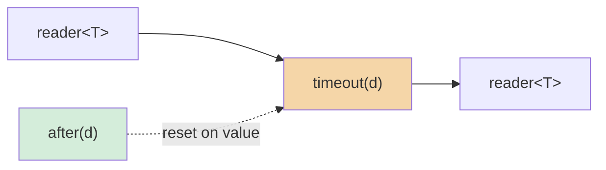

# timeout

Close the output if no value arrives within a deadline. Each incoming value
resets the timer. Values are forwarded unchanged.

**Header:** `<csp/part/timeout.h>`

## Synopsis

```cpp
template <typename T>
auto timeout(csp::clock::duration d);
```

Returns a `filter<T, T>`.

## Parameters

| Parameter | Type | Description |
|-----------|------|-------------|
| `d` | `csp::clock::duration` | Maximum idle time before closing |

## Diagram



### Timing

```
in:  ──1──2──────────────────────
     │←d→│←────── d ──────→│
out: ──1──2─────────────────X (closed)
```

The timer resets on each value. If `d` elapses with no input, the output
closes.

## Semantics

- A timer of duration `d` starts immediately on construction.
- Each incoming value is forwarded to the output and the timer is reset.
- If the timer fires (no value arrived within `d`), the filter closes output
  and returns.
- **Values arrive faster than `d`:** all values pass through. The timer never
  fires.
- **Values stop arriving:** after the last value, the timer fires after `d`
  and the output closes.
- On input close (before timeout), the filter returns normally (output closes
  when the filter's writer is dropped).
- On output close, the filter returns immediately.

## Usage

### As a pipeline filter

```cpp
using namespace std::chrono_literals;

// Close if no value arrives for 5 seconds.
auto r = timeout<int>(5s).spawn(source.spawn());
```

### Composed with `|`

```cpp
auto pipeline = some_source | timeout<int>(1s) | map<int>([](int n) {
    return n * 2;
});
```

### Standalone spawn

```cpp
auto ch = timeout<int>(100ms).spawn();
csp::spawn([w = std::move(ch.w)] {
    w << 1;
    csp::sleep(200ms);  // Exceeds 100ms timeout.
    w << 2;             // Timeout already fired; write may fail.
});
// Output: 1 (then closed by timeout)
```

## Example

```cpp
#include <csp/csp.h>
#include <csp/part/timeout.h>
#include <csp/part/count.h>

using namespace csp::part;
using namespace std::chrono_literals;

csp::schedule([] {
    // count sends 1-5 instantly -- well within 1s timeout.
    auto r = timeout<int>(1s).spawn(count(1, 6).spawn());

    // All values pass through.
    for (int v; r >> v;) { /* 1, 2, 3, 4, 5 */ }
});
```

## See also

- [delay](delay.md) -- delay every value by a fixed duration
- [debounce](debounce.md) -- suppress until quiet, then emit
- [gate](gate.md) -- pause/resume via a control channel
