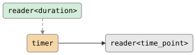

# csp::part::timer

Convert a stream of sleep requests into a stream of actual fire times. Each
value read from the control channel triggers a sleep (relative or absolute),
after which the actual wall-clock time is emitted.

**Header:** `#include "csp.h"`

## Signature

```cpp
// Relative durations: sleep for each duration, then emit now().
inline reader<time_point> timer(reader<duration> control);

// Absolute time_points: sleep until each deadline, then emit now().
inline reader<time_point> timer(reader<time_point> control);
```

Returns a `reader<time_point>`.

## Parameters

| Parameter | Type | Description |
|-----------|------|-------------|
| `control` | `reader<duration>` | Stream of relative sleep intervals |

or

| Parameter | Type | Description |
|-----------|------|-------------|
| `control` | `reader<time_point>` | Stream of absolute deadlines |

## Topology

<!-- csp-flow
  reader<duration>
         |
   {timer} -> reader<time_point>
-->


### Timing (duration overload)

```
control: ──100ms──200ms──150ms──|
output:  ────────t1──────────t2──────t3──|
```

Each control value triggers a sleep; the output emits the actual time when the
sleep completes.

## Semantics

- Each value read from `control` becomes a sleep request: a `duration` is
  passed to `csp::sleep`, a `time_point` is passed to `csp::sleep_until`.
- After the sleep completes, `csp::now()` is emitted on the output.
- Sleeps are serialized: the next control value is not read until the current
  sleep finishes and the output value is accepted.
- **Control closes:** the output closes (no more values to sleep on).
- **Output closes:** the timer returns immediately (the next write after sleep
  fails, ending the imp).
- The emitted time_point is the *actual* fire time, which may be slightly later
  than the requested deadline due to scheduling.

## Example

```cpp
#include "csp.h"

using namespace csp::part;
using namespace std::chrono_literals;

// Send two durations on a control channel.
auto [ctrl_w, ctrl_r] = csp::chan<csp::duration>{};
auto r = timer(std::move(ctrl_r));

csp::spawn([w = std::move(ctrl_w)] {
    w << 50ms;
    w << 100ms;
});

// Read two fire times.
csp::time_point t1, t2;
r >> t1;
r >> t2;
// t2 - t1 >= 100ms (the second sleep duration).
```

## See also

- [delay](delay.md) -- delay each value by a fixed duration
- [debounce](debounce.md) -- suppress rapid values until a quiet period
- [throttle](throttle.md) -- rate-limit by dropping excess values
- [sample](sample.md) -- emit latest value on trigger
