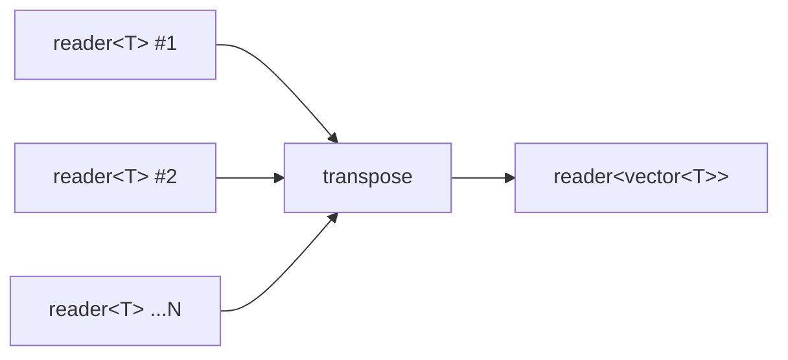

# transpose

Dynamic-width lockstep zip. Reads one element from each of N input readers per
round and emits the collected values as a `std::vector<T>`. Stops as soon as
any input is exhausted or the output reader is dropped.

## Signature

```cpp
template <typename T>
auto transpose(std::vector<reader<T>> inputs);
// Returns: producer<std::vector<T>, ...>
```

## Topology



One internal imp reads from each input in sequence per round, collects
the values into a vector, and writes the vector to the output.

## Semantics

- Each round reads exactly one element from every input reader (left to right)
  and emits them as a single `std::vector<T>`.
- If any input reader is exhausted mid-round, the partial vector is discarded
  and the output closes. No partial vectors are ever emitted.
- Terminates when any input dies, all inputs are exhausted after a complete
  round, or the output reader is dropped.
- All inputs must produce at the same rate for full utilization. The output
  length equals the length of the shortest input.
- Backpressure: the imp blocks on each vector write, so a slow consumer
  throttles all inputs.
- An empty input vector produces an immediately-closed output.
- Unlike `zip`, which combines heterogeneous readers into tuples,
  `transpose` works with a homogeneous dynamic collection of readers.

## Example

```cpp
#include "csp.h"

using namespace csp;
using namespace csp::part;

// Three columns transposed into row vectors.
std::vector<reader<int>> cols;
cols.push_back(count(1, 4).spawn());   // 1, 2, 3
cols.push_back(count(4, 7).spawn());   // 4, 5, 6
cols.push_back(count(7, 10).spawn());  // 7, 8, 9
auto r = transpose(std::move(cols)).spawn();
// Reads: {1,4,7}, {2,5,8}, {3,6,9}
```

## See Also

- [zip](zip.md) -- heterogeneous lockstep combination (tuples or combining function)
- [merge](merge.md) -- non-deterministic fan-in (no lockstep)
