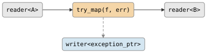

# csp::part::try_map

Transforms each element, catching exceptions from the mapping function. On
success, the mapped value passes through. On exception, the `exception_ptr` is
sent to an error channel and the input value is dropped.

A second overload without an error channel delegates to `map` — exceptions
propagate normally.

## Signature

```cpp
template <typename A, typename B = A, typename F>
auto try_map(F&& f, writer<std::exception_ptr> err);

template <typename A, typename B = A, typename F>
auto try_map(F&& f);
// Returns: filter<A, B, ...>
```

## Topology

<!-- csp-flow
reader<A> -> {try_map(f, err)} -> reader<B>
                    |
       writer<exception_ptr>
-->


One internal imp reads from the input, applies `f`, and writes the result to the
output. If `f` throws, the exception is caught and sent to `err`.

## Semantics

- Exits when the input is exhausted or the output reader is dropped.
- If `f` throws, `std::current_exception()` is written to `err`. The input
  value is dropped and the imp continues with the next element.
- If writing to `err` fails (error channel closed), the imp exits. Normal
  processing continues uninterrupted while `err` is open — dropping the error
  reader only matters when an exception actually occurs.
- Backpressure: the imp blocks on each output write and on each error write,
  so a slow consumer or slow error handler throttles the pipeline.
- Without an error channel, `try_map(f)` is equivalent to `map(f)`.

## Example

```cpp
#include "csp.h"

using namespace csp;
using namespace csp::part;

auto src = chan<int>();
auto err = chan<std::exception_ptr>();

auto out = std::move(src.r) | try_map<int>([](int n) -> int {
    if (n < 0) throw std::runtime_error("negative");
    return n * 2;
}, std::move(err.w));

spawn([w = std::move(src.w)]{ w << 1; w << -1; w << 2; });

// out reads: 2, 4
// err reads: exception_ptr wrapping runtime_error("negative")
```

## See Also

- [map](map.md) -- transform without error handling
- [where](where.md) -- filter elements by predicate
- [flat_map](flat_map.md) -- map each element to a sub-stream, then merge
