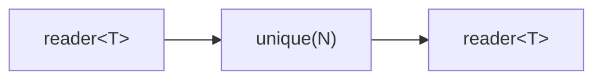

# unique

Suppresses all-time duplicate values using a hash set. Each value is emitted at
most once (or once per eviction cycle when bounded). An optional
`max_remembered` parameter limits memory usage with FIFO eviction.

## Signature

```cpp
template <typename T, typename Hash = std::hash<T>,
          typename Eq = std::equal_to<T>>
auto unique(size_t max_remembered = 0, Hash hash = {}, Eq eq = {});
// Returns: filter<T, T, ...>
```

## Topology



One internal microthread reads from the input, checks a hash set, and forwards
values not previously seen.

## Semantics

- Exits when the input is exhausted or the output reader is dropped.
- **Unbounded** (`max_remembered == 0`, default): every unique value ever seen
  is remembered. Memory grows with the number of distinct values.
- **Bounded** (`max_remembered > 0`): the set holds at most `max_remembered`
  values. When capacity is reached, the oldest remembered value is evicted
  (FIFO), allowing it to pass through again if it reappears later.
- Uses a flat hash set internally for O(1) average lookup and insertion.
- Values are moved into the output channel.

## Example

```cpp
#include <csp/csp.h>
#include <csp/part/unique.h>

using namespace csp;
using namespace csp::part;

// Unbounded: suppress all repeated values.
auto u = unique<int>().spawn();
// Input:  1, 2, 3, 2, 1, 4
// Output: 1, 2, 3, 4

// Bounded (max_remembered=2): FIFO eviction.
auto u2 = unique<int>(2).spawn();
// 1 -> emit, set={1}
// 2 -> emit, set={1,2}
// 3 -> evict 1, emit, set={2,3}
// 2 -> in set, suppress
// 1 -> not in set, evict 2, emit, set={3,1}
// Output: 1, 2, 3, 1
```

## See Also

- [distinct](distinct.md) -- suppress consecutive duplicates only
- [where](where.md) -- filter by arbitrary predicate
