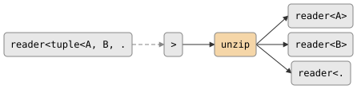

# unzip

Splits a reader of tuples into N independent readers, one per tuple element.
The inverse of [zip](zip.md).

## Signature

```cpp
// Direct unzip of tuple stream.
template <typename... Ts>
auto unzip(reader<std::tuple<Ts...>> in);
// Returns: std::tuple<reader<Ts>...>

// Unzip through a decomposing function.
template <typename In, typename F>
auto unzip(reader<In> in, F&& f);
// Returns: std::tuple<reader<A>, reader<B>, ...>
//   where tuple<A, B, ...> = std::invoke_result_t<F, In>
```

The function overload applies `f` to each input value to produce a tuple,
then distributes the elements across the output readers.

## Topology

<!-- csp-flow
                                   -> reader<A>
reader<tuple<A, B, ...>> -> {unzip} -> reader<B>
                                   -> reader<...>
-->


A spawned imp reads tuples from the input and writes each element to
its corresponding output channel.

## Semantics

- Spawns an imp immediately (unlike filter/producer parts which are
  lazy). The returned readers are live from the moment `unzip` is called.
- Each tuple element is written to its output channel in order. If any
  output write fails (reader dropped), the remaining elements in that tuple
  are still attempted via short-circuit `&&`.
- Exits when the input is exhausted.
- All output readers must be drained concurrently (or by separate
  imps), since the channels are synchronous and the unzip
  imp writes to each output in sequence.

## Example

```cpp
#include "csp.h"

using namespace csp;
using namespace csp::part;

// Round-trip: zip then unzip.
auto src = zip(count(1, 4).spawn(),
               count(10, 40, 10).spawn()).spawn();
auto [ra, rb] = unzip(std::move(src));

// ra reads: 1, 2, 3
// rb reads: 10, 20, 30

// Decompose with a function.
auto [rq, rr] = unzip(count(0, 5).spawn(),
    [](int n) { return std::make_pair(n / 2, n % 2); });
// rq reads: 0, 0, 1, 1, 2  (quotients)
// rr reads: 0, 1, 0, 1, 0  (remainders)
```

## See Also

- [zip](zip.md) -- inverse operation: combine N readers into tuples
- [partition](partition.md) -- split by predicate (content-based routing)
- [round_robin](round_robin.md) -- distribute by position (index-based routing)
