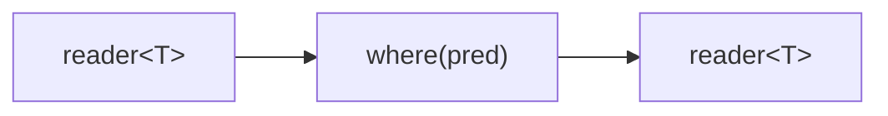

# where

Filters a stream, forwarding only elements for which a predicate returns true.

## Signature

```cpp
template <typename T, typename Pred>
auto where(Pred&& pred);
// Returns: filter<T, T, ...>
```

## Topology



One internal microthread reads from the input, tests each value with `pred`,
and writes matching values to the output.

## Semantics

- Exits when the input is exhausted or the output reader is dropped.
- Elements that fail the predicate are silently discarded. If the predicate
  rejects everything, the output channel closes once the input is exhausted.
- Backpressure: the microthread blocks on each output write, so the
  producer is only throttled when a matching element is being forwarded. The
  producer can run ahead while the filter is discarding elements.
- Values are moved into the output channel when the predicate passes.

## Example

```cpp
#include "csp.h"

using namespace csp;
using namespace csp::part;

// Keep only multiples of 3.
auto r = where<int>([](int n) { return n % 3 == 0; })
             .spawn(count(0, 20).spawn());
// Reads: 0, 3, 6, 9, 12, 15, 18
```

## See Also

- [map](map.md) -- transform elements
- [take_while](../parts/take_while.md) -- forward elements while predicate holds, then stop
- [skip_while](../parts/skip_while.md) -- discard elements while predicate holds, then forward the rest
