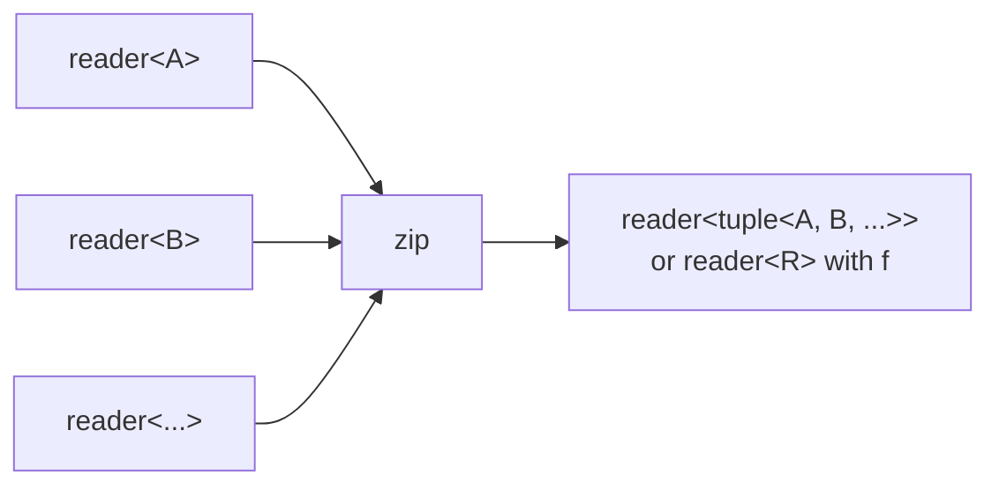

# zip

Combines N input readers element-wise, producing one output value per
synchronized read across all inputs. Terminates when any input is exhausted
or the output dies.

## Signature

```cpp
// Zip into tuples.
template <typename... Ts>
auto zip(reader<Ts>... rs);
// Returns: producer<std::tuple<Ts...>, ...>

// Zip through a combining function.
template <typename... Ts, typename F>
auto zip(reader<Ts>... rs, F&& f);
// Returns: producer<std::invoke_result_t<F, Ts...>, ...>
```

When called without a function, `zip` produces tuples. When called with a
combining function `f`, the result type is `std::invoke_result_t<F, Ts...>`.

For the function overload, explicit template parameters are required:
`zip<int, int>(r1, r2, f)`.

## Topology



One internal microthread reads from each input in sequence (using `alt` to
also watch for output death), then writes the combined result.

## Semantics

- Reads are performed one input at a time (left to right). Each read also
  monitors the output for death via `alt`, enabling early termination.
- Terminates as soon as any input reader is exhausted or the output reader
  is dropped.
- All inputs must produce at the same rate for zip to be useful. If inputs
  have different lengths, the output length equals the shortest input.
- Backpressure: the microthread blocks on each output write, so a slow
  consumer throttles all inputs.

## Example

```cpp
#include "csp.h"

using namespace csp;
using namespace csp::part;

// Zip into tuples.
auto r = zip(count(1, 4).spawn(),
             count(10, 40, 10).spawn()).spawn();
// Reads: (1,10), (2,20), (3,30)

// Zip with combining function.
auto r2 = zip<int, int>(
    count(1, 5).spawn(),
    count(10, 50, 10).spawn(),
    [](int a, int b) { return a * b; }).spawn();
// Reads: 10, 40, 90, 160

// Ternary zip into tuples.
auto r3 = zip(count(1, 4).spawn(),
              count(10, 40, 10).spawn(),
              count(100, 400, 100).spawn()).spawn();
// Reads: (1,10,100), (2,20,200), (3,30,300)
```

## See Also

- [unzip](unzip.md) -- inverse operation: split a tuple stream into N readers
- [merge](merge.md) -- non-deterministic merge (no synchronization)
- [interleave](interleave.md) -- deterministic round-robin merge
