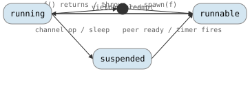

# Scheduling Reference

Functions for creating, running, and cooperatively scheduling imps.

## Imp Lifecycle

<!-- csp-state
[*] -> runnable : spawn(f)
runnable -> running : scheduled
running -> runnable : yield / preempt
running -> suspended : channel op / sleep
suspended -> runnable : peer ready / timer fires
running -> [*] : f() returns / throws
-->


---

## Table of Contents

1. [spawn](#spawn) -- create a new imp
2. [schedule](#schedule) -- run the scheduler to completion
3. [yield](#yield) -- cooperative context switch
4. [init_runtime](#init_runtime) -- enable M:N multi-threaded mode
5. [spawn_producer](#spawn_producer) -- spawn an imp with an output channel
6. [spawn_consumer](#spawn_consumer) -- spawn an imp with an input channel
7. [spawn_filter](#spawn_filter) -- spawn an imp with input and output channels

---

## spawn

Create a new imp that executes a callable.

### Signature

```cpp
template <typename F>
reader<std::exception_ptr> spawn(F&& f);
```

**Header:** `#include "csp.h"`

### Description

`spawn` creates a new imp that runs `f()`. The callable is
move-captured into the imp's context and invoked when the imp
is first scheduled. The new imp inherits its parent's dynamic context
(`dynamic<T>` bindings via HAMT reference), but does **not** inherit
imp-local storage -- the child starts with a fresh local context.

If `f` throws an exception, spawn catches it and attempts to write it to the
returned `reader<std::exception_ptr>`. If the caller has already dropped that
reader, the exception is forwarded to the global exception handler. If that
also fails, `std::terminate` is called.

`spawn` can be called from within an imp (nested spawn) or from the
main thread before `schedule()`. Each call allocates a stack from the stack
pool, constructs the imp at the top of the region, and performs a
handshake context switch to initialize the new imp's execution
context.

In single-threaded mode, the new imp runs immediately until it
yields or blocks. In M:N mode, the new imp is placed on the global
run queue for any worker to pick up.

### Transition rules ([syntax](transition-rules.md))

```
spawn(f) ────────────────────────➤ new imp M created; M becomes runnable;
                                   → reader<std::exception_ptr>

M.f() exits normally ────────────➤ exception channel closed; M destroyed
M.f() throws e ──────────────────➤ e written to exception channel; M destroyed
M.f() throws e ─┤channel dead├──➤ e written to global_exception_handler; M destroyed
M.f() throws e ─┤both dead├─────➤ std::terminate()
```

### Example

```cpp
#include "csp.h"

csp::spawn([] {
    // This runs in a new imp.
    csp::yield();  // cooperatively yield
});
csp::schedule();
```

---

## schedule

Drive the imp scheduler to completion.

### Signature

```cpp
void schedule();
```

**Header:** `#include "csp.h"`

### Description

`schedule` blocks the calling OS thread and runs the scheduler loop until all
imps have exited. In single-threaded mode (the default), `schedule`
drives execution directly by repeatedly picking the next runnable imp
and context-switching to it, sleeping when only timers remain. In M:N mode,
`schedule` parks the main thread and waits for the worker threads to drain all
imps.

`schedule` must be called from the main OS thread, not from within a
imp. It is typically called once after all initial `spawn` calls.

The default scheduler loop can be replaced with `set_scheduler` for custom
scheduling strategies.

### Transition rules ([syntax](transition-rules.md))

```
schedule() ─┤imps exist├─➤ block calling thread; run scheduler loop
schedule() ─┤all MTs finished├───➤ return
```

### Example

```cpp
#include "csp.h"

csp::spawn([] {
    // imp work
});
csp::spawn([] {
    // more imp work
});
csp::schedule();  // runs both imps to completion
```

---

## yield

Cooperatively yield execution to another runnable imp.

### Signature

```cpp
void yield();
```

**Header:** `#include "csp.h"`

### Description

`yield` moves the current imp to the back of its processor's run
queue and context-switches to the next runnable imp. If no other
imp is runnable, `yield` returns immediately without switching.

`yield` is a cooperative scheduling point -- imps that perform
long-running computations without channel operations should call `yield`
periodically to avoid starving other imps.

### Transition rules ([syntax](transition-rules.md))

```
yield() ─┤others runnable├──➤ current MT moves to back of run queue;
                               next MT resumes
yield() ─┤none runnable├────➤ return immediately (no-op)
```

### Example

```cpp
#include "csp.h"

csp::spawn([] {
    for (int i = 0; i < 1000000; ++i) {
        // CPU-bound work
        if (i % 1000 == 0) csp::yield();
    }
});
csp::schedule();
```

---

## init_runtime

Enable M:N multi-threaded mode with multiple worker OS threads.

### Signature

```cpp
void init_runtime(int num_procs = 0);
```

**Header:** `#include "csp.h"`

### Description

`init_runtime` initializes the M:N runtime with `num_procs` processor
structures (Ps), each backed by a worker OS thread. If `num_procs` is 0, the
runtime uses `std::thread::hardware_concurrency()`. If `num_procs` is 1, the
runtime stays in single-threaded cooperative mode (the default if
`init_runtime` is never called).

When `num_procs` > 1, the runtime enters M:N mode:

- Worker threads run a loop that checks the local run queue, the global run
  queue, and attempts work stealing from other processors, in that order.
- Workers park on a condition variable when no work is available and are
  unparked when new imps are scheduled or timers fire.
- A watchdog thread monitors processor heartbeats and can add new processors
  if a worker appears stalled (e.g., blocked in a system call).

`init_runtime` must be called before any `spawn` or `schedule` calls. If
never called, the runtime auto-initializes with a single processor on first
use.

### Transition rules ([syntax](transition-rules.md))

```
init_runtime(0) ────────────────➤ create hardware_concurrency() Ps + workers
init_runtime(1) ────────────────➤ single-threaded mode (no workers spawned)
init_runtime(n) ─┤n > 1├────────➤ create n Ps; spawn n-1 worker threads + watchdog
```

### Example

```cpp
#include "csp.h"

// Use 4 OS threads for imp execution.
csp::init_runtime(4);

csp::spawn([] { /* work */ });
csp::spawn([] { /* work */ });
csp::schedule();
csp::shutdown_runtime();
```

---

## spawn_producer

Spawn an imp that writes to a new channel, returning the read end.

### Signature

```cpp
template <typename T, typename F>
reader<T> spawn_producer(F&& f);
```

**Header:** `#include "csp.h"`

### Description

`spawn_producer` creates a `chan<T>`, spawns an imp that calls
`f(writer<T>)` with the write end, and returns the read end to the caller.
The imp owns the writer; when `f` returns or the writer goes out of
scope, the write end closes and the returned reader will observe channel
death.

This is a convenience wrapper around `spawn` for the common pattern of a
goroutine-like producer that generates a stream of values.

### Transition rules ([syntax](transition-rules.md))

```
spawn_producer<T>(f) ────────────➤ chan<T> created; imp M spawned;
                                   M calls f(writer<T>);
                                   → reader<T>

f returns ───────────────────────➤ writer<T> closed; reader sees dead channel
```

### Example

```cpp
#include "csp.h"

auto r = csp::spawn_producer<int>([](csp::writer<int> w) {
    for (int i = 0; i < 10; ++i) {
        w << i;
    }
});

csp::spawn([r = std::move(r)] {
    for (int v : r) {
        // process v: 0, 1, 2, ..., 9
    }
});
csp::schedule();
```

---

## spawn_consumer

Spawn an imp that reads from a new channel, returning the write end.

### Signature

```cpp
template <typename T, typename F>
writer<T> spawn_consumer(F f);
```

**Header:** `#include "csp.h"`

### Description

`spawn_consumer` creates a `chan<T>`, spawns an imp that calls
`f(reader<T>)` with the read end, and returns the write end to the caller.
The imp owns the reader; the caller writes values into the returned
writer.

### Transition rules ([syntax](transition-rules.md))

```
spawn_consumer<T>(f) ────────────➤ chan<T> created; imp M spawned;
                                   M calls f(reader<T>);
                                   → writer<T>

caller closes writer ────────────➤ reader sees dead channel; f can exit
```

### Example

```cpp
#include "csp.h"

auto w = csp::spawn_consumer<int>([](csp::reader<int> r) {
    for (int v : r) {
        // process each value
    }
});

csp::spawn([w = std::move(w)] {
    for (int i = 0; i < 5; ++i) {
        w << i;
    }
});
csp::schedule();
```

---

## spawn_filter

Spawn an imp that reads from one channel and writes to another,
returning both external endpoints.

### Signature

```cpp
template <typename T, typename F>
chan<T> spawn_filter(F&& f);
```

**Header:** `#include "csp.h"`

### Description

`spawn_filter` creates two channels (input and output), spawns an imp
that calls `f(reader<T>, writer<T>)`, and returns a `chan<T>` whose `w`
member is the input writer and whose `r` member is the output reader. The
caller writes into `.w` and reads from `.r`, with the spawned imp
transforming values in between.

### Transition rules ([syntax](transition-rules.md))

```
spawn_filter<T>(f) ──────────────➤ input chan<T> + output chan<T> created;
                                   imp M spawned;
                                   M calls f(input reader, output writer);
                                   → chan<T>{input writer, output reader}
```

### Example

```cpp
#include "csp.h"

// A filter that doubles every value.
auto ch = csp::spawn_filter<int>([](csp::reader<int> r, csp::writer<int> w) {
    for (int v : r) {
        w << v * 2;
    }
});

csp::spawn([w = std::move(ch.w)] {
    for (int i = 1; i <= 5; ++i) {
        w << i;
    }
});

csp::spawn([r = std::move(ch.r)] {
    for (int v : r) {
        // v: 2, 4, 6, 8, 10
    }
});
csp::schedule();
```
