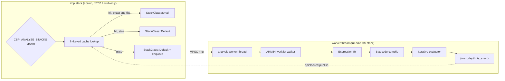

# Stack Depth Analysis

Canonical system note for CSP’s spawn-time stack depth analyser.
**As of v0.28.0+** (ARM64 walker through 🎯T3.10, plus the v0.28.0
audit-campaign fix — `BR` tail-call resolution now respects the
instruction budget via the shared `resolve_indirect_callee` helper — the
🎯T52.1 structural-soundness pass: closed-world SP-write detection,
decoded FP/SIMD + single-register writeback, wired `max_call_depth` —
the 🎯T52.4 async pipeline: spawn never analyses on imp stacks; cache
misses take Default and enqueue for a runtime-owned worker thread —
and 🎯T52.3: `csp::spawn<F>` analyses the concrete invoke thunk past
the type-erasure boundary, composed with a documented `C_shell`).
Design history lives in the papers listed at the end; this page is the
authoritative *as shipped* picture.

Header: `#include <csp/stack_analysis.h>`  
Implementation: `src/stack_analysis_arm64.cc`  
Runtime consumer: `src/csp.cc` (`spawn` under `#ifdef CSP_ANALYSE_STACKS`)

---

## Table of Contents

1. [Role in the runtime](#role-in-the-runtime)
2. [Public API](#public-api)
3. [Build and platform gates](#build-and-platform-gates)
4. [Pipeline](#pipeline)
5. [What the ARM64 walker covers](#what-the-arm64-walker-covers)
6. [Soundness rules](#soundness-rules)
7. [Spawn integration (slot class)](#spawn-integration-slot-class)
8. [Profile feedback](#profile-feedback)
9. [Accuracy in practice](#accuracy-in-practice)
10. [Known limits and next leaps](#known-limits-and-next-leaps)
11. [Tests and CI](#tests-and-ci)
12. [Paper and target map](#paper-and-target-map)

---

## Role in the runtime

Every imp gets a stack from `StackPool`. Without analysis, every imp takes a
**Default** slot (large, always safe). With the analyser enabled, `spawn`
may select a **Small** arena slot (~16 KB usable) when a **sound exact**
upper bound fits with headroom.

| Actor | File | Role |
|---|---|---|
| User callable `F` + optional `data` | caller | Entry function address and live closure / data pointer |
| `spawn_invoke<F>` | `include/csp/csp.h` | 🎯T52.3 concrete analysis root (direct call into `F`) |
| `kShellStackBytes` (`C_shell`) | `stack_analysis.h` | Fixed imp-entry overhead composed with user-entry depth |
| `analyze_stack_depth*` | `stack_analysis.h`, `stack_analysis_arm64.cc` | Walk machine code; return `{max_depth, is_exact}` |
| `stack_analysis_lookup_or_request` | `stack_analysis_arm64.cc` | 🎯T52.4 spawn-side stub: fn-keyed cache lookup; miss → enqueue |
| Analysis worker | `stack_analysis_arm64.cc` | 🎯T52.4 runtime-owned OS thread: dequeues, analyses, publishes |
| `spawn` | `src/csp.cc` | Chooses `StackClass::Small` only if exact and tight enough |
| `StackPool` | `stack_pool.*` | Default vs Small free lists (arena mode) |
| `check_stack_overflow` | internal | Soft-guard tripwire at CSP suspend checkpoints |

**Invariant:** if `is_exact`, `max_depth` must not under-estimate the true
peak SP displacement of that entry (with the documented ABI caveats in the
audit). The runtime multiplies by headroom before comparing to the Small
slot; an inexact result always keeps Default.

Paper [23](../papers/23-stack-analysis-gaps.md) once described the analyser
as implemented-but-unwired. That is **historical**: 🎯T3.4.1 wired it into
`spawn` behind `CSP_ANALYSE_STACKS`.

---

## Public API

```cpp
namespace csp {

struct stack_analysis {
    size_t max_depth;  // Max SP displacement (bytes) over analysed paths
    bool is_exact;     // false if budgets / unresolved indirects remain
};

struct stack_analysis_options {
    size_t indirect_call_budget = 2048;  // bytes per unresolved BLR/BR
    int max_call_depth = 64;             // clamped to [1, 64] (hard cap)
    size_t max_instructions = 100000;
};

stack_analysis analyze_stack_depth(
    const void* fn,
    const void* data = nullptr,
    stack_analysis_options opts = {});

// Cache-friendly / spawn path: reuses prior results when valid.
stack_analysis analyze_stack_depth_cached(
    const void* fn,
    const void* data = nullptr,
    stack_analysis_options opts = {});

}
```

- `data`, when non-null, is the spawn data pointer (typically the closure).
  Loads whose provenance traces to this pointer can resolve nested function
  pointers and vtable-like patterns from live memory.
- `is_exact == false` means the result is a **conservative over-approximation**
  that includes flat budgets for unresolved edges, not a precise frame size.
- `max_call_depth` (🎯T52.1) is wired to the evaluator’s on-stack cycle-set
  capacity (hard compile-time cap 64). A call chain deeper than the limit is
  refused exactly like a detected recursion cycle: budget + `is_exact=false`.

---

## Build and platform gates

| Condition | Behaviour |
|---|---|
| `__aarch64__` | Full walker in `stack_analysis_arm64.cc` |
| Other arches (incl. x86_64) | Stub: `{32 KiB, is_exact=false}` |
| Default product build | Analyser **compiled out** of `spawn` unless `CSP_ANALYSE_STACKS` |
| `make ANALYSE=1` / CI “stack analyser enabled” job | Defines `CSP_ANALYSE_STACKS`; exercises Small-slot path and audit |
| Arena stacks (`CSP_USE_ARENA_STACKS`) | Small slots exist (`small_slot_usable_bytes() == 16 KiB`) |
| Non-arena (Windows, some sanitizer layouts) | `small_slot_usable_bytes() == 0` → no Small path |

There is **no x86_64 walker**. See [future directions](../stack-analysis-future.md)
for a sketch of what that would require.

---

## Pipeline



Since 🎯T52.4 no analysis executes on imp stacks. `spawn`'s stub
(`csp::detail::stack_analysis_lookup_or_request`) is lookup-only: an
fn-keyed cache hit gates the slot class; a miss takes **Default
immediately** and enqueues the entry on a fixed-capacity (256-slot) MPSC
ring for a runtime-owned worker thread — a plain `std::thread`, not an
imp — which runs the ordinary synchronous pipeline and publishes through
the existing spinlocked caches. A full ring drops the request silently
(Default stands; a later spawn retries). The worker is started by
`Runtime::init()` and stopped (flag + wake + join) by
`Runtime::shutdown()`, so `shutdown_runtime()` + `set_maxprocs()`
re-init cycles restart it; an `atexit` stop registered at first start
also joins it before any static destructor can tear the caches out from
under a mid-analysis walk. The synchronous public API
(`analyze_stack_depth`, `analyze_stack_depth_cached`) is unchanged.

Important implementation properties:

1. **Iterative** walk and eval (no deep C++ recursion for the CFG / call graph).
2. **Bootstrap-safe code applies only to the spawn stub** (🎯T52.4). The
   stub — spinlock + open-addressing lookup + ring push — is
   allocation-free pure inline atomics/arithmetic, and it is the only
   analysis code left in spawn's own walk corpus: the analyser verifies
   its own stub (`is_exact`, measured frame **0 bytes** at -O2 — a true
   leaf, no BL, no SP write; this feeds 🎯T52.3's `C_shell` audit). The
   worker may use ordinary containers and, in future, third-party code
   (Zydis, unwind parsers) — the historical requirement that the whole
   analyser stay self-analysable is dissolved. The walker/evaluator still
   use the open-addressing containers and intrusive `expr_ptr` they were
   built with, but that is now an implementation detail, not a contract.
3. **Program cache** keyed by function address for default-seed,
   `data == nullptr` walks.
4. **Specialised walks** (live `data` and/or non-default register seeds from
   🎯T3.10) are compiled on demand and **not** mixed into the fn-only cache
   (soundness: paper [30](../papers/30-walker-register-provenance.md)).

---

## What the ARM64 walker covers

### Control and stack

| Class | Instructions / forms |
|---|---|
| Frame | `SUB/ADD SP, SP, #imm`; `STP`/`LDP` pre/post-index writeback on SP — GP **and FP/SIMD** pairs (W/X, S/D/Q); single-register `STR`/`LDR` pre/post-index writeback on SP, all widths (🎯T52.1) |
| Unmodelled SP writes | Closed-world detector (🎯T52.1): any other SP-writing encoding class (`MOV SP, Xn` family, add/sub extended incl. `SUB SP, SP, Xn`, AdvSIMD structure post-index, MTE forms) terminates the path with budget + `is_exact=false` |
| Return | `RET` |
| Direct call | `BL offset` → callee compile + eval |
| Indirect call / tail | `BLR Xn`, `BR Xn` (since v0.28.0 `BR` respects the over-budget cap like `BL`/`BLR`, via the shared `resolve_indirect_callee` helper) |
| Branches | `B`, `B.cond`, `CBZ`/`CBNZ`, `TBZ`/`TBNZ` |

### Register provenance and data context

| Origin | Meaning |
|---|---|
| `DATA_OFFSET` | Derived from the spawn `data` pointer at a known byte offset |
| `PC_RELATIVE` | Resolved `ADRP`+`ADD` (or related) absolute address; segment bounds (🎯T3.4.2) gate safe reads |
| `CONST` | Immediate / narrow load (`MOVZ`/`MOVK`, `LDRB`/`LDRH`, selected `LDR` W) used for branch pruning |

Cross-`BL` behaviour (🎯T3.4.3 + 🎯T3.10):

- Direct calls can forward **X0–X7** provenance into the callee seed
  (`OP_CALL_DIRECT_WITH_DATA` / args variant), so a callable arriving in
  **X1** (AAPCS64 second argument) can still be resolved.
- `CONST` discriminators can prune callee branches when still live at the
  call site.
- Unresolvable `BLR`/`BR` contribute `indirect_call_budget` and clear exactness.

### Segment bounds (🎯T3.4.2)

One-time discovery of executable / const data ranges:

- **macOS:** dyld image headers + `getsectiondata` (`__TEXT,__text`,
  `__DATA_CONST,__const`) so `__stubs` stay out of bounds.
- **Linux:** `dl_iterate_phdr` `PT_LOAD` scan.

Out-of-bounds or foreign targets fall back to budget (sound over-approx).

---

## Soundness rules

1. **Never choose Small from an inexact result.** Exactness is the only gate
   for down-sizing (`src/csp.cc`, 🎯T33 / fable 2026-07).
2. **Never choose Small from profile high-water alone.** Checkpoint samples
   miss peaks between suspends and are keyed per `EntryFn`, not per instance.
3. **Unresolved edges budget, they do not vanish.** Budget may be large, but
   `is_exact` is false.
4. **Under sanitizers**, instrumentation stubs (`__asan_*`, `__tsan_*`) live
   outside the walker’s text bound → forced inexact. Soundness still holds;
   tightness is not meaningful there.
5. **No silent SP drift** (🎯T52.1). Any instruction that can architecturally
   write SP and is not explicitly decoded is refused by a closed-world
   structural detector (budget + `is_exact=false`) — the invariant does not
   depend on the modelled enumeration staying complete.
6. **Cycle detection never degrades** (🎯T52.1). The evaluator’s on-stack set
   reports capacity exhaustion; past `max_call_depth` (≤ 64) a callee is
   refused exactly like a detected cycle instead of silently escaping the
   set.

Hard CI gate (`test/stack_analysis_audit.test.cc`): if `is_exact &&
analyser_estimate + floor < high_water`, the build fails.

---

## Spawn integration (slot class)

Under `CSP_ANALYSE_STACKS` and arena Small slots (🎯T52.3 + 🎯T52.4):

```text
// csp::spawn<F> passes analyse_fn = &spawn_invoke<F> (concrete root)
// direct internal::spawn leaves analyse_fn null → walk entry itself
root ← analyse_fn ? analyse_fn : entry_fn
sa   ← stack_analysis_lookup_or_request(root)   // lookup-only stub
         hit  → the worker-published result
         miss → {32 KiB, inexact} + enqueue(root) for the worker
depth ← sa.max_depth + (analyse_fn ? kShellStackBytes : 0)
needed ← depth * 2 + 2 KiB + sizeof(Imp)
if sa.is_exact && needed ≤ 16 KiB usable → Small else Default
```

### Type-erasure boundary (🎯T52.3)

Before this target, `spawn` analysed the type-erased `spawn_entry<F>`
trampoline. That shell contains exception landing pads and a channel
send on the report path, so the walker almost never returned `is_exact`
for real `csp::spawn(lambda)` imps — the dominant Default fallback was
a **wiring gap**, not a walker gap.

`csp::spawn<F>` now hands the specialised `spawn_invoke<F>` address
(and the live closure as `data`) to `internal::spawn`. The invoke thunk
is a direct call into `F::operator()` with no exception/channel shell,
so bodies the walker can bound go exact. Slot depth composes:

```text
depth = C_shell + analyze(spawn_invoke<F>).max_depth
```

where `C_shell = kShellStackBytes` (1024 B). Derivation:

| Source | Value |
|---|---|
| Painted true-peak of `noop_entry` (ANALYSE arena, darwin-arm64) | ≈352 B |
| Guard margin for `spawn_entry` frames under the user body + ABI drift | ≥2× |
| **`kShellStackBytes`** | **1024 B** |

The audit asserts measured noop true-peak ≤ `kShellStackBytes` whenever
painting is on. Residual (not in `C_shell`): the exception-report path
(`w << ex` inside `spawn_entry`) is scheduler-bound and deep; Small
selection covers the non-throwing body. Soft-guard overflow checks
remain the tripwire for residual paths. The live closure is available
on the spawn path for a future data-path pre-scan (🎯T52.5); the
async worker still walks with `data == nullptr` today.

**First-spawn semantics:** the first spawn of an entry always takes
Default (analysis has not run yet); spawns after the worker publishes
take Small when the result is exact and fits. This is irrelevant to the
density story — the win is per-entry steady state, not the first
instance.

**Data soundness:** the fn-keyed cache holds only unspecialised
(`data == nullptr`) results, and the stub serves them for any spawn
`data`. That is sound: an exact null-data result means no path depended
on data (data-dependent calls budget to inexact without data), and
data-derived CONST pruning only ever removes paths from the max — the
null-data bound covers every closure.

**Profile budget:** the 🎯T3.4.4 high-water refinement of
`indirect_call_budget` is applied by the worker at analysis time, not on
the spawn path (the spawn stub takes no mutexes beyond the result-cache
spinlock). It still only sharpens inexact magnitudes; `is_exact` remains
the sole Small gate.

Constants: `kArenaSmallSlotUsable = 16 KiB`, software guard 4 KB
(`include/csp/internal/stack_pool.h`); `kShellStackBytes = 1024`
(`include/csp/stack_analysis.h`).

---

## Profile feedback

When `CSP_ANALYSE_STACKS` is on, each suspend that has `entry_fn_` /
`entry_sp_` records a high-water into a per-entry table (🎯T3.4.4).

| Uses high-water for | Does **not** use high-water for |
|---|---|
| Raising `indirect_call_budget` on later spawns of the same entry | Selecting `StackClass::Small` |
| Making inexact estimates less wasteful on Default | Claiming exactness |

---

## Accuracy in practice

### Shapes that routinely go exact

- Leaf / short direct `BL` chains  
- Indirect through `data` / closure with known layout  
- PC-relative fn-pointer tables and closure→vptr→method patterns (T3.4.2)  
- Branch pruning via `LDRB`/`LDRH` discriminators  
- Callable in **X1** after prologue save to callee-saved (T3.10)  
- CONST arg pruning across `BL` (T3.10)

Covered by `test/stack_analysis.test.cc` and the tightness **candidates** in
the audit.

### Shapes that stay inexact (by design today)

Bodies that bottom out in **type-erased** runtime dispatch the walker
cannot follow from the invoke root alone — channel rendezvous, `yield`,
scheduler internals, PLT stubs. Those cases remain **sound** (budgeted,
Default slot) but not tight. The type-erased `spawn_entry` trampoline
itself is no longer on the analysis path for `csp::spawn<F>` (🎯T52.3).

Typical audit split (ARM64, non-sanitizer): tightness candidates exact;
channel/yield/buffer fixtures marked soundness-only and `is_exact=false`.

### Product consequence

Shallow, exact-analysable user bodies (no channel/scheduler callees)
land on **Small** after the worker publishes. Channel-heavy and
scheduler-bound bodies stay on **Default**. The corpus Small-rate
(🎯T52.2 metric) is the product number; see below for the pre/post
🎯T52.3 baseline.

---

## Known limits and next leaps

Still open (not regressions of the bullets above):

| Gap | Impact |
|---|---|
| **x86_64 / non-ARM64** | Stub 32 KiB inexact only |
| **Data-dependent closures on the async path** | Worker walks with `data == nullptr`; live-closure resolution is 🎯T52.5 |
| **Dynamic SP** (`SUB SP, SP, Xn`, and the `mov x9, sp; sub xN, x9, x8; mov sp, xN` sequence Clang actually emits for runtime `alloca`) | Immediate budget path (via the closed-world SP-write detector; pre-🎯T52.1 the MOV-to-SP lowering was invisible — a 64 KiB alloca analysed as `{16, exact}`) |
| **Switch / jump tables** | Not followed as tables (only via resolved BLR/BR) |
| **Mutual indirect recursion fixed-point** | Explicitly out of scope for T3.10 |
| **Off by default** | Product builds need `CSP_ANALYSE_STACKS` for any effect |

(FP/SIMD stack ops — `STP Q…` writeback and friends — were a gap here until
🎯T52.1: they were silently ignored, drifting the SP delta *in either
direction* inside exact results. They are now decoded exactly; any remaining
unmodelled SP-writing encoding is refused, not skipped.)

Forward-looking design notes (not current truth):  
[`docs/stack-analysis-future.md`](../stack-analysis-future.md).

---

## Tests and CI

| Suite | Path | Role |
|---|---|---|
| Unit / feature | `test/stack_analysis.test.cc` | Exactness on crafted shapes; 🎯T52.4 stub walkability (`is_exact` on the stub itself) |
| Soundness + tightness audit | `test/stack_analysis_audit.test.cc` | Hard under-estimate fail; report ratios |
| Slot selection | `test/stack_slot_sizing.test.cc` | Small never from profile-only / inexact; 🎯T52.4 first-spawn = Default, post-publication = Small |
| Profile table | `test/stack_profile.test.cc` | High-water recording (ANALYSE builds) |

Deterministic async testing: `csp::internal::analysis_quiesce()` blocks
until every request enqueued before the call has been dequeued and its
result published (returns immediately when the worker is not running).
Test-only; call from a plain OS thread, not from inside an imp.

CI: default matrix runs the suite without sizing; a dedicated **“stack
analyser enabled”** step builds with `ANALYSE=1` and runs slot-sizing tests.
ASan/UBSan full suite still runs the audit for the soundness gate (tightness
may skip under instrumentation).

### Ground-truth oracles (🎯T52.2)

Two oracles upgrade the audit from “no violation observed at checkpoints”
to measured ground truth:

- **Painted true-peak watermark.** On ANALYSE **arena** builds
  (`CSP_STACK_PAINT`, from `csp_internal.h`), `spawn()` paints every
  handed-out slot with `0xA5` before the fcontext boot record is written
  (per handout, so reuse repaints), and `destroy_imp()` scans forward from
  the guard end for the first unpainted byte before the slot returns to
  the free list — the TRUE peak, including depth reached *between* suspend
  points that the checkpoint sampler structurally misses. The audit’s hard
  under-estimate gate compares exact analyser estimates against this
  painted peak (plus the measured runtime-shell floor), and separately
  asserts painted peak ≥ checkpoint high-water. Painting is compiled out
  elsewhere: Windows stacks are demand-committed `MEM_RESERVE` regions
  (painting would fault-commit every page), sanitizer builds would trip
  ASan red-zone poisoning during the scan, and neither has Small slots to
  gate. `maybe_shrink` is a no-op on arena builds, so painting never races
  page reclaim.

- **Corpus Small-slot metric + ratchet.** `make ANALYSE=1 stack-metric`
  runs the real corpus (full test suite + finite examples) with
  `CSP_STACK_STATS=1` (same env-gated idiom as `CSP_PROC_STATS`); the
  runtime dumps `CSP_STACK_SPAWNS_TOTAL/_SMALL/_BYTES_SAVED` at exit, and
  `scripts/stack_metric.py` aggregates Small-slot rate and bytes saved vs
  all-Default (Small landings × the 108 KiB per-slot footprint delta),
  then ratchets **both directions** against
  `scripts/stack_metric_baseline.json` — regressions fail, and
  improvements fail too until the baseline is deliberately updated
  (`--update-baseline`) and committed. CI runs it on the Linux arm64 row.
  Recorded pre-🎯T52.3 baseline (locked in
  `scripts/stack_metric_baseline.json`, 2026-07-30): darwin-arm64 4
  Small / ~1.83 M spawns (rate ≈ 2.2 × 10⁻⁶); linux-arm64 5 Small /
  ~1.83 M (rate ≈ 2.7 × 10⁻⁶) — confirming the expected ≈0: the
  type-erased trampoline kept real workloads on Default; the few
  landings were `internal::spawn` fixtures with exact EntryFns.

  Post-🎯T52.3 (darwin-arm64, 2026-07-31): **1 054 292 Small /
  1 830 909 spawns (rate ≈ 0.576, ~108.6 GiB address-space footprint
  saved)** — material lift from ≈0. The residual Default mass is
  channel/scheduler-bound bodies and first-spawn-per-entry misses
  (async publish). Baseline locked in
  `scripts/stack_metric_baseline.json` with noise-tolerant windows.

---

## Paper and target map

| Doc / target | Relationship to this page |
|---|---|
| [05 stack engineering](../papers/05-stack-engineering.md) | Motivation |
| [08 context-aware analysis](../papers/08-context-aware-stack-analysis.md) | Design space (spawn-time context) |
| [20 arena scaling](../papers/20-arena-stack-scaling.md) | Small/Default consumer |
| [23 gap audit](../papers/23-stack-analysis-gaps.md) | T3.4 decomposition; **pre-wiring snapshot** — superseded for “is it wired?” |
| [30 register provenance](../papers/30-walker-register-provenance.md) | T3.10 design + what landed |
| 🎯T3.4, T3.4.1–T3.4.5, T3.10 | All **achieved** in `bullseye.yaml` |
| 🎯T52.1, T52.2, T52.3, T52.4 | Structural soundness; ground-truth oracles; concrete invoke + `C_shell`; async off-imp-stack analysis |
| [fable 2026-07](../audit/fable-2026-07.md) | Why profile must not select Small |

When this document and a paper disagree about *current* behaviour, **prefer
this document and the code**.
