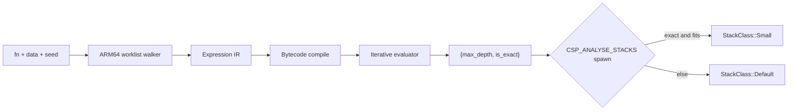

# Stack Depth Analysis

Canonical system note for CSP’s spawn-time stack depth analyser.
**As of v0.27.0** (ARM64 walker through 🎯T3.10). Design history lives in
the papers listed at the end; this page is the authoritative *as shipped*
picture.

Header: `#include <csp/stack_analysis.h>`  
Implementation: `src/stack_analysis_arm64.cc`  
Runtime consumer: `src/csp.cc` (`spawn` under `#ifdef CSP_ANALYSE_STACKS`)

---

## Table of Contents

1. [Role in the runtime](#role-in-the-runtime)
2. [Public API](#public-api)
3. [Build and platform gates](#build-and-platform-gates)
4. [Pipeline](#pipeline)
5. [What the ARM64 walker covers](#what-the-arm64-walker-covers)
6. [Soundness rules](#soundness-rules)
7. [Spawn integration (slot class)](#spawn-integration-slot-class)
8. [Profile feedback](#profile-feedback)
9. [Accuracy in practice](#accuracy-in-practice)
10. [Known limits and next leaps](#known-limits-and-next-leaps)
11. [Tests and CI](#tests-and-ci)
12. [Paper and target map](#paper-and-target-map)

---

## Role in the runtime

Every imp gets a stack from `StackPool`. Without analysis, every imp takes a
**Default** slot (large, always safe). With the analyser enabled, `spawn`
may select a **Small** arena slot (~16 KB usable) when a **sound exact**
upper bound fits with headroom.

| Actor | File | Role |
|---|---|---|
| User callable `F` + optional `data` | caller | Entry function address and live closure / data pointer |
| `analyze_stack_depth*` | `stack_analysis.h`, `stack_analysis_arm64.cc` | Walk machine code; return `{max_depth, is_exact}` |
| `spawn` | `src/csp.cc` | Chooses `StackClass::Small` only if exact and tight enough |
| `StackPool` | `stack_pool.*` | Default vs Small free lists (arena mode) |
| `check_stack_overflow` | internal | Soft-guard tripwire at CSP suspend checkpoints |

**Invariant:** if `is_exact`, `max_depth` must not under-estimate the true
peak SP displacement of that entry (with the documented ABI caveats in the
audit). The runtime multiplies by headroom before comparing to the Small
slot; an inexact result always keeps Default.

Paper [23](../papers/23-stack-analysis-gaps.md) once described the analyser
as implemented-but-unwired. That is **historical**: 🎯T3.4.1 wired it into
`spawn` behind `CSP_ANALYSE_STACKS`.

---

## Public API

```cpp
namespace csp {

struct stack_analysis {
    size_t max_depth;  // Max SP displacement (bytes) over analysed paths
    bool is_exact;     // false if budgets / unresolved indirects remain
};

struct stack_analysis_options {
    size_t indirect_call_budget = 2048;  // bytes per unresolved BLR/BR
    int max_call_depth = 64;
    size_t max_instructions = 100000;
};

stack_analysis analyze_stack_depth(
    const void* fn,
    const void* data = nullptr,
    stack_analysis_options opts = {});

// Cache-friendly / spawn path: reuses prior results when valid.
stack_analysis analyze_stack_depth_cached(
    const void* fn,
    const void* data = nullptr,
    stack_analysis_options opts = {});

}
```

- `data`, when non-null, is the spawn data pointer (typically the closure).
  Loads whose provenance traces to this pointer can resolve nested function
  pointers and vtable-like patterns from live memory.
- `is_exact == false` means the result is a **conservative over-approximation**
  that includes flat budgets for unresolved edges, not a precise frame size.

---

## Build and platform gates

| Condition | Behaviour |
|---|---|
| `__aarch64__` | Full walker in `stack_analysis_arm64.cc` |
| Other arches (incl. x86_64) | Stub: `{32 KiB, is_exact=false}` |
| Default product build | Analyser **compiled out** of `spawn` unless `CSP_ANALYSE_STACKS` |
| `make ANALYSE=1` / CI “stack analyser enabled” job | Defines `CSP_ANALYSE_STACKS`; exercises Small-slot path and audit |
| Arena stacks (`CSP_USE_ARENA_STACKS`) | Small slots exist (`small_slot_usable_bytes() == 16 KiB`) |
| Non-arena (Windows, some sanitizer layouts) | `small_slot_usable_bytes() == 0` → no Small path |

There is **no x86_64 walker**. See [future directions](../stack-analysis-future.md)
for a sketch of what that would require.

---

## Pipeline



Important implementation properties:

1. **Iterative** walk and eval (no deep C++ recursion for the CFG / call graph).
2. **Bootstrap-safe containers** (open-addressing maps/sets, intrusive `expr_ptr`)
   so analysing the analyser itself does not inject unresolved BLRs from
   `std::unordered_map` / `shared_ptr`.
3. **Program cache** keyed by function address for default-seed,
   `data == nullptr` walks.
4. **Specialised walks** (live `data` and/or non-default register seeds from
   🎯T3.10) are compiled on demand and **not** mixed into the fn-only cache
   (soundness: paper [30](../papers/30-walker-register-provenance.md)).

---

## What the ARM64 walker covers

### Control and stack

| Class | Instructions / forms |
|---|---|
| Frame | `SUB/ADD SP, SP, #imm`; `STP`/`LDP` pre/post-index (64-bit GP) |
| Return | `RET` |
| Direct call | `BL offset` → callee compile + eval |
| Indirect call / tail | `BLR Xn`, `BR Xn` |
| Branches | `B`, `B.cond`, `CBZ`/`CBNZ`, `TBZ`/`TBNZ` |

### Register provenance and data context

| Origin | Meaning |
|---|---|
| `DATA_OFFSET` | Derived from the spawn `data` pointer at a known byte offset |
| `PC_RELATIVE` | Resolved `ADRP`+`ADD` (or related) absolute address; segment bounds (🎯T3.4.2) gate safe reads |
| `CONST` | Immediate / narrow load (`MOVZ`/`MOVK`, `LDRB`/`LDRH`, selected `LDR` W) used for branch pruning |

Cross-`BL` behaviour (🎯T3.4.3 + 🎯T3.10):

- Direct calls can forward **X0–X7** provenance into the callee seed
  (`OP_CALL_DIRECT_WITH_DATA` / args variant), so a callable arriving in
  **X1** (AAPCS64 second argument) can still be resolved.
- `CONST` discriminators can prune callee branches when still live at the
  call site.
- Unresolvable `BLR`/`BR` contribute `indirect_call_budget` and clear exactness.

### Segment bounds (🎯T3.4.2)

One-time discovery of executable / const data ranges:

- **macOS:** dyld image headers + `getsectiondata` (`__TEXT,__text`,
  `__DATA_CONST,__const`) so `__stubs` stay out of bounds.
- **Linux:** `dl_iterate_phdr` `PT_LOAD` scan.

Out-of-bounds or foreign targets fall back to budget (sound over-approx).

---

## Soundness rules

1. **Never choose Small from an inexact result.** Exactness is the only gate
   for down-sizing (`src/csp.cc`, 🎯T33 / fable 2026-07).
2. **Never choose Small from profile high-water alone.** Checkpoint samples
   miss peaks between suspends and are keyed per `EntryFn`, not per instance.
3. **Unresolved edges budget, they do not vanish.** Budget may be large, but
   `is_exact` is false.
4. **Under sanitizers**, instrumentation stubs (`__asan_*`, `__tsan_*`) live
   outside the walker’s text bound → forced inexact. Soundness still holds;
   tightness is not meaningful there.

Hard CI gate (`test/stack_analysis_audit.test.cc`): if `is_exact &&
analyser_estimate + floor < high_water`, the build fails.

---

## Spawn integration (slot class)

Under `CSP_ANALYSE_STACKS` and arena Small slots:

```text
opts.indirect_call_budget ← max(default 2 KiB, profile_hw * 1.5)   // if hw > 0
sa ← analyze_stack_depth_cached(entry_fn, data, opts)
needed ← sa.max_depth * 2 + 2 KiB + sizeof(Imp)
if sa.is_exact && needed ≤ 16 KiB usable → Small else Default
```

Constants: `kArenaSmallSlotUsable = 16 KiB`, software guard 4 KB
(`include/csp/internal/stack_pool.h`).

---

## Profile feedback

When `CSP_ANALYSE_STACKS` is on, each suspend that has `entry_fn_` /
`entry_sp_` records a high-water into a per-entry table (🎯T3.4.4).

| Uses high-water for | Does **not** use high-water for |
|---|---|
| Raising `indirect_call_budget` on later spawns of the same entry | Selecting `StackClass::Small` |
| Making inexact estimates less wasteful on Default | Claiming exactness |

---

## Accuracy in practice

### Shapes that routinely go exact

- Leaf / short direct `BL` chains  
- Indirect through `data` / closure with known layout  
- PC-relative fn-pointer tables and closure→vptr→method patterns (T3.4.2)  
- Branch pruning via `LDRB`/`LDRH` discriminators  
- Callable in **X1** after prologue save to callee-saved (T3.10)  
- CONST arg pruning across `BL` (T3.10)

Covered by `test/stack_analysis.test.cc` and the tightness **candidates** in
the audit.

### Shapes that stay inexact (by design today)

Anything that bottoms out in **type-erased** runtime dispatch the walker
cannot follow from the entry alone — especially **`csp::spawn(lambda)`**
trampolines and much of the channel / scheduler body. Those cases remain
**sound** (budgeted, Default slot) but not tight.

Typical audit split (ARM64, non-sanitizer): tightness candidates exact;
channel/yield/buffer fixtures marked soundness-only and `is_exact=false`.

### Product consequence

Most real CSP imps still land on **Default** stacks. Small-slot wins show up
for shallow, data-resolvable entries when the feature is compiled in — not
as a universal “every lambda is 16 KB” mode.

---

## Known limits and next leaps

Still open (not regressions of the bullets above):

| Gap | Impact |
|---|---|
| **x86_64 / non-ARM64** | Stub 32 KiB inexact only |
| **Type-erased spawn trampoline** | Dominant reason real workloads stay Default |
| **FP/SIMD stack ops** (`STP Q…`) | Silent ignore → rare under-count if those dominate |
| **Dynamic SP** (`SUB SP, SP, Xn`) | Immediate budget path |
| **Switch / jump tables** | Not followed as tables (only via resolved BLR/BR) |
| **Mutual indirect recursion fixed-point** | Explicitly out of scope for T3.10 |
| **Off by default** | Product builds need `CSP_ANALYSE_STACKS` for any effect |

Forward-looking design notes (not current truth):  
[`docs/stack-analysis-future.md`](../stack-analysis-future.md).

---

## Tests and CI

| Suite | Path | Role |
|---|---|---|
| Unit / feature | `test/stack_analysis.test.cc` | Exactness on crafted shapes |
| Soundness + tightness audit | `test/stack_analysis_audit.test.cc` | Hard under-estimate fail; report ratios |
| Slot selection | `test/stack_slot_sizing.test.cc` | Small never from profile-only / inexact |
| Profile table | `test/stack_profile.test.cc` | High-water recording (ANALYSE builds) |

CI: default matrix runs the suite without sizing; a dedicated **“stack
analyser enabled”** step builds with `ANALYSE=1` and runs slot-sizing tests.
ASan/UBSan full suite still runs the audit for the soundness gate (tightness
may skip under instrumentation).

---

## Paper and target map

| Doc / target | Relationship to this page |
|---|---|
| [05 stack engineering](../papers/05-stack-engineering.md) | Motivation |
| [08 context-aware analysis](../papers/08-context-aware-stack-analysis.md) | Design space (spawn-time context) |
| [20 arena scaling](../papers/20-arena-stack-scaling.md) | Small/Default consumer |
| [23 gap audit](../papers/23-stack-analysis-gaps.md) | T3.4 decomposition; **pre-wiring snapshot** — superseded for “is it wired?” |
| [30 register provenance](../papers/30-walker-register-provenance.md) | T3.10 design + what landed |
| 🎯T3.4, T3.4.1–T3.4.5, T3.10 | All **achieved** in `bullseye.yaml` |
| [fable 2026-07](../audit/fable-2026-07.md) | Why profile must not select Small |

When this document and a paper disagree about *current* behaviour, **prefer
this document and the code**.
