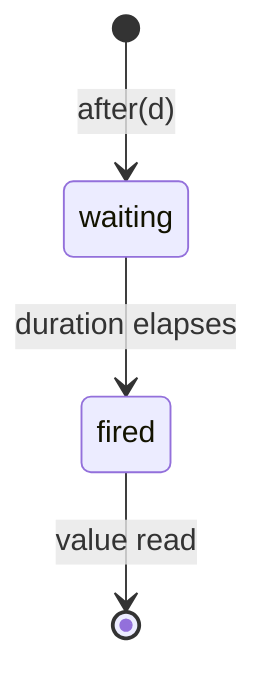
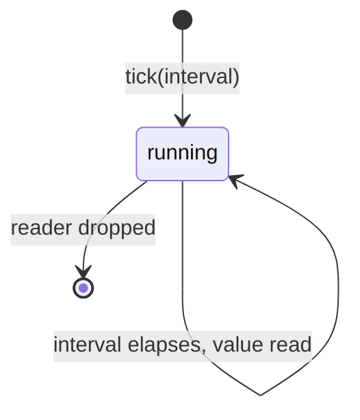

# Timers Reference

Primitives for time-based operations: sleeping, one-shot timers, and periodic
ticks. All functions run inside microthreads and integrate with the scheduler's
sleep queue.

All types and functions live in `namespace csp`. Header: `#include "csp/timer.h"`.

---

## Table of Contents

1. [clock](#clock) -- time types and current time
2. [sleep](#sleep) -- suspend for a duration
3. [sleep_until](#sleep_until) -- suspend until a time point
4. [after](#after) -- one-shot timer
5. [tick](#tick) -- periodic timer

---

## clock

Type alias for the steady clock used by all timer primitives.

### Signature

```cpp
using clock = std::chrono::steady_clock;
```

### Description

`csp::clock` is an alias for `std::chrono::steady_clock`. All timer functions
accept `csp::clock::duration` and `csp::clock::time_point` values. Because the
clock is steady (monotonic), it is immune to wall-clock adjustments.

Commonly used nested types:

| Type | Meaning |
|------|---------|
| `csp::clock::time_point` | An absolute point in time on the steady clock. |
| `csp::clock::duration` | A signed duration (nanosecond resolution on most platforms). |

`csp::clock::now()` returns the current `time_point`. This is equivalent to
`std::chrono::steady_clock::now()`.

### Example

```cpp
#include "csp/timer.h"

auto start = csp::clock::now();
// ... work ...
auto elapsed = csp::clock::now() - start;
```

---

## sleep

Suspend the current microthread for a given duration.

### Signature

```cpp
void sleep(clock::duration d);
```

### Description

`sleep` suspends the calling microthread for at least `d`. The microthread is
placed on the scheduler's sleep queue and becomes runnable again once the
deadline passes. Other microthreads continue to execute during the sleep.

`sleep` must be called from within a microthread. Calling it from the main
thread (outside `schedule`) is undefined.

The actual wakeup time may be slightly later than `clock::now() + d` due to
scheduling latency -- the microthread becomes runnable after the deadline but
must wait for a processor to pick it up.

### Transition rules ([syntax](transition-rules.md))

```
sleep(d) ────────────────➤ suspend; deadline = clock::now() + d
         ─┤deadline passes├─➤ microthread becomes runnable; return
```

### Example

```cpp
#include "csp/timer.h"

csp::spawn([] {
    csp::sleep(std::chrono::milliseconds(100));
    // resumes ~100ms later
});
csp::schedule();
```

---

## sleep_until

Suspend the current microthread until an absolute time point.

### Signature

```cpp
void sleep_until(clock::time_point tp);
```

### Description

`sleep_until` suspends the calling microthread until the steady clock reaches
`tp`. If `tp` is already in the past, the microthread yields and is immediately
re-scheduled.

This is the underlying primitive used by `sleep`, which computes
`clock::now() + d` and delegates to `sleep_until`.

### Transition rules ([syntax](transition-rules.md))

```
sleep_until(tp) ─┤tp in future├──➤ suspend; deadline = tp
                 ─┤deadline passes├─➤ microthread becomes runnable; return
sleep_until(tp) ─┤tp in past├────➤ yield; return
```

### Example

```cpp
#include "csp/timer.h"

csp::spawn([] {
    auto deadline = csp::clock::now() + std::chrono::seconds(1);

    // ... do some work ...

    // Sleep for the remainder of the 1-second window.
    csp::sleep_until(deadline);
});
csp::schedule();
```

---

## after

One-shot timer that fires after a duration.

### Signature

```cpp
reader<clock::time_point> after(clock::duration d);
```

### States



| State | Meaning |
|-------|---------|
| waiting | Timer is running; the internal microthread is sleeping. |
| fired | Duration elapsed; a `time_point` is available on the reader. |

### Description

`after` returns a `reader<clock::time_point>` that produces a single
`time_point` value (the actual fire time) after the given duration elapses.
Internally, `after` spawns a producer microthread that sleeps for `d` and
then writes `clock::now()` to the channel.

The returned reader is most commonly used as a timeout arm in `alt` or `prialt`:

```cpp
csp::prialt(
    r >> val,                  // wait for data
    csp::after(1s) >> nullptr  // timeout after 1 second
);
```

After the single value is read, the internal producer exits and the reader
transitions to dead. If the reader is dropped before the timer fires, the
producer microthread is unblocked (writer sees dead channel) and exits cleanly.

### Transition rules ([syntax](transition-rules.md))

```
after(d) ───────────────────────➤ spawn producer; → reader<time_point>
         ─┤d elapses├──────────➤ producer writes time_point; reader has value
reader >> dest ─┤value ready├───➤ move(time_point, dest); true; producer exits
reader >> dest ─┤waiting├───────➤ suspend until value ready
~reader (dropped) ──────────────➤ producer sees dead channel; exits
```

### Example

```cpp
#include "csp/timer.h"

csp::spawn([] {
    auto [w, r] = csp::chan<int>{};

    csp::spawn([w = std::move(w)] {
        csp::sleep(std::chrono::seconds(5));
        w << 42;
    });

    int val;
    int which = csp::prialt(
        r >> val,
        csp::after(std::chrono::seconds(1)) >> nullptr
    );

    if (which == 1) {
        // Timed out after 1 second.
    }
});
csp::schedule();
```

---

## tick

Periodic timer that fires at a regular interval.

### Signature

```cpp
reader<clock::time_point> tick(clock::duration interval);
```

### States



| State | Meaning |
|-------|---------|
| running | Timer is active; the internal microthread sleeps and writes on each interval. |

### Description

`tick` returns a `reader<clock::time_point>` that produces the current time
(`clock::now()`) every `interval`. Internally, `tick` spawns a producer
microthread that maintains an absolute deadline and advances it by `interval`
after each write. This absolute-deadline approach prevents drift: even if a
particular read is delayed, subsequent ticks remain aligned to the original
schedule.

**Backpressure.** The producer blocks on each write until the consumer reads.
If the consumer is slow, ticks are not queued -- the producer simply waits.
This means the consumer never receives a burst of stale ticks after a delay.

**Shutdown.** When the returned reader is dropped (or goes out of scope), the
producer's write fails and the microthread exits. No explicit cancellation is
needed.

### Transition rules ([syntax](transition-rules.md))

```
tick(interval) ─────────────────➤ spawn producer; next = now() + interval; → reader<time_point>

producer loop:
  sleep_until(next) ────────────➤ suspend until next
  w << now() ─┤reader alive├───➤ deliver time_point; next += interval; repeat
  w << now() ─┤reader dead├────➤ producer exits
```

### Example

```cpp
#include "csp/timer.h"

csp::spawn([] {
    auto ticker = csp::tick(std::chrono::milliseconds(100));

    for (int i = 0; i < 10; ++i) {
        auto t = ticker.read();
        // Fires every ~100ms; t is the time of each tick.
    }
    // ticker goes out of scope; producer exits.
});
csp::schedule();
```
