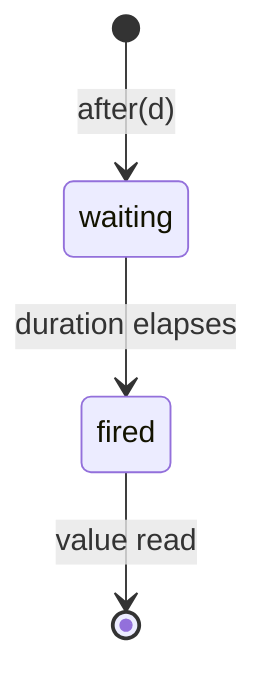
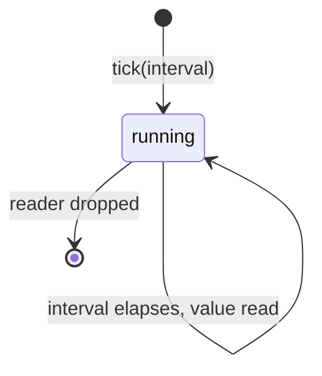

# Timers Reference

Primitives for time-based operations: sleeping, one-shot timers, and periodic
ticks. All functions run inside imps and integrate with the scheduler's
sleep queue.

All types and functions live in `namespace csp`. Header: `#include "csp/timer.h"`.

---

## Table of Contents

1. [clock](#clock) -- time types and current time
2. [now](#now) -- current time (respects fake clock)
3. [sleep](#sleep) -- suspend for a duration
4. [sleep_until](#sleep_until) -- suspend until a time point
5. [after](#after) -- one-shot timer
6. [tick](#tick) -- periodic timer
7. [fake_clock](#fake_clock) -- deterministic time for testing
8. [clock](#clock-1) -- dynamic variable for clock injection

---

## clock

Type aliases for the steady clock types used by all timer primitives.

### Signature

```cpp
using time_point = std::chrono::steady_clock::time_point;
using duration = std::chrono::steady_clock::duration;
```

### Description

`csp::time_point` and `csp::duration` are aliases for the corresponding
`std::chrono::steady_clock` types. All timer functions accept `csp::duration`
and `csp::time_point` values. Because the underlying clock is steady
(monotonic), it is immune to wall-clock adjustments.

| Type | Meaning |
|------|---------|
| `csp::time_point` | An absolute point in time on the steady clock. |
| `csp::duration` | A signed duration (nanosecond resolution on most platforms). |

`csp::now()` returns the current `time_point`. If a `csp::clock` is bound in
the current dynamic scope, it returns the fake clock's time; otherwise it
returns `std::chrono::steady_clock::now()`.

### Example

```cpp
#include "csp/timer.h"

auto start = csp::now();
// ... work ...
auto elapsed = csp::now() - start;
```

---

## now

Current time, respecting clock override.

### Signature

```cpp
time_point now();
```

### Description

`now()` returns the current time. If `csp::clock` is bound to a
`fake_clock*` in the current dynamic scope, it returns the fake clock's time.
Otherwise it returns `std::chrono::steady_clock::now()`.

All timer primitives (`sleep`, `sleep_until`, `after`, `tick`) use `now()`
internally, so binding a fake clock affects all time-dependent code
transparently.

### Example

```cpp
#include "csp/timer.h"

csp::fake_clock fc;
csp::local l{csp::clock = &fc};

auto t1 = csp::now();     // epoch (fake clock starts at 0)
fc.advance(1s);
auto t2 = csp::now();     // epoch + 1s
```

---

## sleep

Suspend the current imp for a given duration.

### Signature

```cpp
void sleep(duration d);
```

### Description

`sleep` suspends the calling imp for at least `d`. The imp is
placed on the scheduler's sleep queue and becomes runnable again once the
deadline passes. Other imps continue to execute during the sleep.

`sleep` must be called from within an imp. Calling it from the main
thread (outside `schedule`) is undefined.

The actual wakeup time may be slightly later than `now() + d` due to
scheduling latency -- the imp becomes runnable after the deadline but
must wait for a processor to pick it up.

### Transition rules ([syntax](transition-rules.md))

```
sleep(d) ────────────────➤ suspend; deadline = now() + d
         ─┤deadline passes├─➤ imp becomes runnable; return
```

### Example

```cpp
#include "csp/timer.h"

csp::spawn([] {
    csp::sleep(std::chrono::milliseconds(100));
    // resumes ~100ms later
});
csp::schedule();
```

---

## sleep_until

Suspend the current imp until an absolute time point.

### Signature

```cpp
void sleep_until(time_point tp);
```

### Description

`sleep_until` suspends the calling imp until the steady clock reaches
`tp`. If `tp` is already in the past, the imp yields and is immediately
re-scheduled.

This is the underlying primitive used by `sleep`, which computes
`now() + d` and delegates to `sleep_until`.

### Transition rules ([syntax](transition-rules.md))

```
sleep_until(tp) ─┤tp in future├──➤ suspend; deadline = tp
                 ─┤deadline passes├─➤ imp becomes runnable; return
sleep_until(tp) ─┤tp in past├────➤ yield; return
```

### Example

```cpp
#include "csp/timer.h"

csp::spawn([] {
    auto deadline = csp::now() + std::chrono::seconds(1);

    // ... do some work ...

    // Sleep for the remainder of the 1-second window.
    csp::sleep_until(deadline);
});
csp::schedule();
```

---

## after

One-shot timer that fires after a duration.

### Signature

```cpp
reader<time_point> after(duration d);
```

### States



| State | Meaning |
|-------|---------|
| waiting | Timer is running; the internal imp is sleeping. |
| fired | Duration elapsed; a `time_point` is available on the reader. |

### Description

`after` returns a `reader<time_point>` that produces a single
`time_point` value (the actual fire time) after the given duration elapses.
Internally, `after` spawns a producer imp that sleeps for `d` and
then writes `now()` to the channel.

The returned reader is most commonly used as a timeout arm in `alt` or `prialt`:

```cpp
csp::prialt(
    r >> val,                  // wait for data
    csp::after(1s) >> nullptr  // timeout after 1 second
);
```

After the single value is read, the internal producer exits and the reader
transitions to dead. If the reader is dropped before the timer fires, the
producer imp is unblocked (writer sees dead channel) and exits cleanly.

### Transition rules ([syntax](transition-rules.md))

```
after(d) ───────────────────────➤ spawn producer; → reader<time_point>
         ─┤d elapses├──────────➤ producer writes time_point; reader has value
reader >> dest ─┤value ready├───➤ move(time_point, dest); true; producer exits
reader >> dest ─┤waiting├───────➤ suspend until value ready
~reader (dropped) ──────────────➤ producer sees dead channel; exits
```

### Example

```cpp
#include "csp/timer.h"

csp::spawn([] {
    auto [w, r] = csp::chan<int>{};

    csp::spawn([w = std::move(w)] {
        csp::sleep(std::chrono::seconds(5));
        w << 42;
    });

    int val;
    int which = csp::prialt(
        r >> val,
        csp::after(std::chrono::seconds(1)) >> nullptr
    );

    if (which == 1) {
        // Timed out after 1 second.
    }
});
csp::schedule();
```

---

## tick

Periodic timer that fires at a regular interval.

### Signature

```cpp
reader<time_point> tick(duration interval);
```

### States



| State | Meaning |
|-------|---------|
| running | Timer is active; the internal imp sleeps and writes on each interval. |

### Description

`tick` returns a `reader<time_point>` that produces the current time
(`now()`) every `interval`. Internally, `tick` spawns a producer
imp that maintains an absolute deadline and advances it by `interval`
after each write. This absolute-deadline approach prevents drift: even if a
particular read is delayed, subsequent ticks remain aligned to the original
schedule.

**Backpressure.** The producer blocks on each write until the consumer reads.
If the consumer is slow, ticks are not queued -- the producer simply waits.
This means the consumer never receives a burst of stale ticks after a delay.

**Shutdown.** When the returned reader is dropped (or goes out of scope), the
producer's write fails and the imp exits. No explicit cancellation is
needed.

### Transition rules ([syntax](transition-rules.md))

```
tick(interval) ─────────────────➤ spawn producer; next = now() + interval; → reader<time_point>

producer loop:
  sleep_until(next) ────────────➤ suspend until next
  w << now() ─┤reader alive├───➤ deliver time_point; next += interval; repeat
  w << now() ─┤reader dead├────➤ producer exits
```

### Example

```cpp
#include "csp/timer.h"

csp::spawn([] {
    auto ticker = csp::tick(std::chrono::milliseconds(100));

    for (int i = 0; i < 10; ++i) {
        auto t = ticker.read();
        // Fires every ~100ms; t is the time of each tick.
    }
    // ticker goes out of scope; producer exits.
});
csp::schedule();
```

---

## fake_clock

Deterministic clock for testing time-dependent code.

### Signature

```cpp
class fake_clock {
public:
    explicit fake_clock(time_point start = time_point{});

    time_point now() const;
    bool has_pending() const;

    void advance(duration d);
    bool advance_to_next();

    void run();
    void run_until_idle();

    void sleep_until_impl(time_point tp);
};
```

### Description

`fake_clock` replaces the real clock for testing. When bound via
`csp::local l{csp::clock = &fc}`, all calls to `csp::now()`,
`sleep`, `sleep_until`, `after`, and `tick` within that dynamic scope (and
any child imps) use the fake clock instead of the real steady clock.

Time only advances when you tell it to:

| Method | Effect |
|--------|--------|
| `advance(d)` | Move time forward by `d`; fire any timers whose deadline has passed. |
| `advance_to_next()` | Jump to the next pending deadline and fire it. Returns `false` if no timers are pending. |
| `run()` | Scheduler loop with auto-advance: alternates between running ready imps and advancing to the next deadline until no work remains. |
| `run_until_idle()` | Run all currently-ready imps without advancing time. Useful for inspecting intermediate state. |

`sleep_until_impl` is called internally by `csp::sleep_until()` when the fake
clock is active. It pushes the current imp onto the fake clock's internal timer
queue and suspends it.

**Constraints.** Single-threaded only (default scheduler or `init_runtime(1)`).
Non-copyable.

### Example

Auto-advance (simplest):
```cpp
csp::fake_clock fc;
csp::local l{csp::clock = &fc};

csp::spawn([&] {
    csp::sleep(1s);
    // ... runs instantly when fc.run() advances time
});
fc.run();
```

Manual advance (inspect intermediate state):
```cpp
csp::fake_clock fc;
csp::local l{csp::clock = &fc};

bool woke = false;
csp::spawn([&] { csp::sleep(100ms); woke = true; });
csp::schedule();

fc.advance(50ms);
fc.run_until_idle();
assert(!woke);      // Not yet.

fc.advance(50ms);
fc.run_until_idle();
assert(woke);       // Now.
```

---

## clock

Dynamic variable for injecting a fake clock.

### Signature

```cpp
extern dynamic<fake_clock*> clock;
```

### Description

`csp::clock` is a dynamically-scoped variable (see
[dynamic scoping](dynamic.md)). Its default value is `nullptr`, meaning the
real steady clock is used. Bind it to a `fake_clock*` to redirect all timer
primitives:

```cpp
csp::fake_clock fc;
csp::local l{csp::clock = &fc};
```

The binding is automatically inherited by child imps spawned within the scope,
with no explicit parameter threading required. When the `local` goes out of
scope, the override is removed and subsequent calls revert to the real clock.
